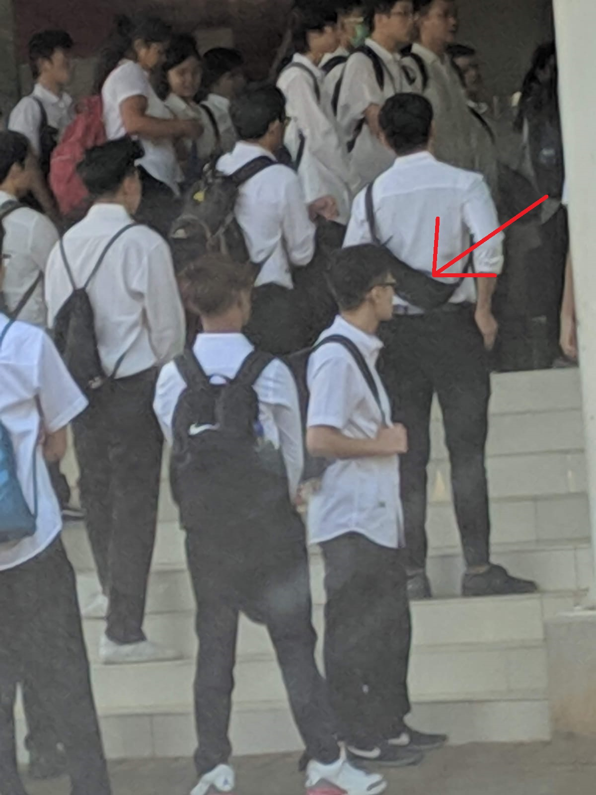
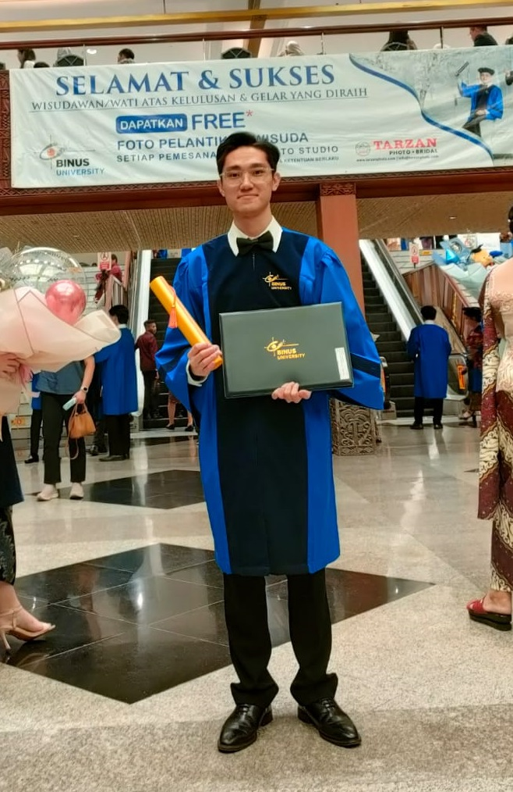

After 4 years of study, I finally graduated from Binus ASO School of Engineering! In this blog, I'll recap my journey.

## Recap

In my first year, I got to know new friends and studied the fundamentals of programming, physics, mechanical and electrical design. A project I did in my first year is the [C language financial recording app](/p/finance-record-c).

In my second year, I continued learning and building my skills by doing multiple projects. Some of them are [Analog Car Cabin Air Exhaust System](/p/car-cabin-exhaust), [Analog Car Door Impact Prevention System](/p/impact-prevention) and [Light-Seeking Robot](/p/light-seeking-robot).

In my third year, I joined a [hydroponics IoT project](/p/depok-iot-hydroponics). I also [taught underclassmen as lecturer assistant and did a project](/p/fir-iir-vhdl). My other projects are [Crash Prevention System](/p/crash-prevention), [National Medical Record Database](/p/medical-record-db), [IoT Motorized Gate and Surveillance System](/p/motorized-gate) and [Smart Car System](/p/smart-car).

In my final year, I interned at [Baran Energy](/p/baran-internship) and worked at [Daun Pintar](/p/daun-pintar). I also finished my [thesis about heliostat](/p/heliostat) and went to Fukuoka, Japan for [Summer Course](/p/summer-course-23). After coming back, my thesis project was presented in [ICEEI 2023](/p/iceei-2023).

Huge thanks to all the lecturers, especially to Mr. Sofyan for allowing me to be his assistant in teaching Digital Systems, Mr. Surya for being my supervisor in internship and final project, Mrs. Winda for always helping me in projects and consultations, and all other lecturers that taught me academically and in life. I'm grateful for my longtime collaborators: Deaven Rivaldi, Felix Wiguna, and Nicholas Sanjaya (whom I interned, worked, and developed my final project with) for sticking with me and helping me improve and be better. Thanks to the companies that gave me the opportunity to intern and work, allowing me to have experience and insights on the industry. Finally, thanks to BINUS ASO for giving me a place to study these past 4 years. These moments will hold a special place in my heart as I move forward in life.

## Graduation

I graduated with a GPA of 3.89/4.00, a score I'm quite proud of, but as I look back I think about the things I could've done better. The graduation event was held in Jakarta Convention Center on 20 November 2023. It was a bittersweet moment, ending a stage of my life while heralding the dawn of new beginnings. With this, I'm ready to turn a new chapter in life as I forge my path forward, armed with the lessons learned, friendships cherished, and dreams that have been kindled throughout this journey.

## Pictures

 
