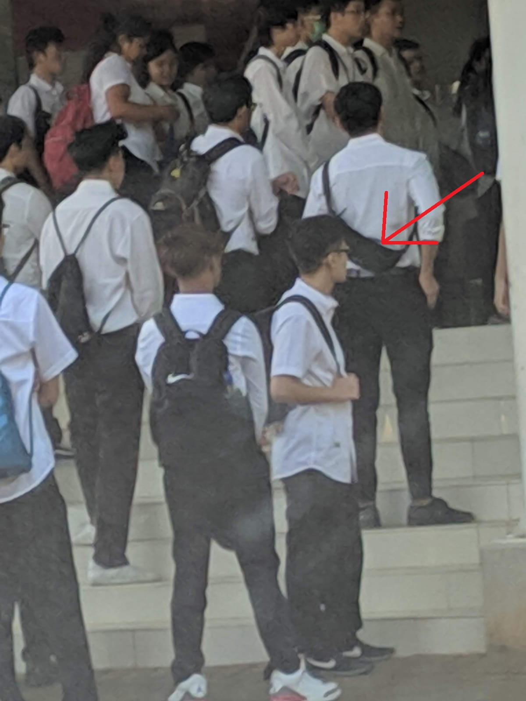
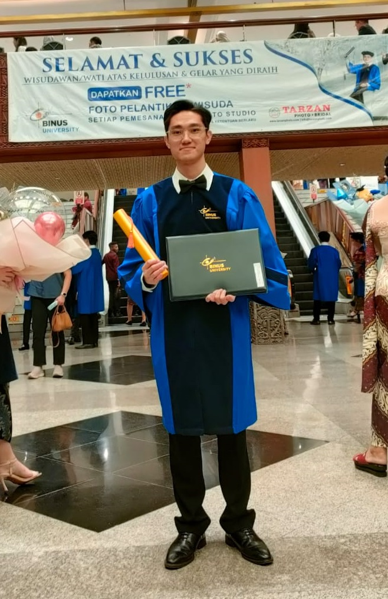

經過四年的學習，我終於從 Binus ASO 工程學院畢業了！在這篇部落格中，我將回顧我的大學旅程。

## 學習回顧

在大一時，我認識了新朋友，並學習了程式設計、物理、機械與電機設計的基礎。我在這一年完成的其中一個專案是 [C 語言財務記錄應用](/p/finance-record-c)。

在大二時，我透過完成多個專案持續精進自己的能力，其中包括 [類比汽車車內排氣系統](/p/car-cabin-exhaust)、[類比車門防撞系統](/p/impact-prevention) 以及 [尋光機器人](/p/light-seeking-robot)。

在大三時，我參與了 [水耕 IoT 專案](/p/depok-iot-hydroponics)。我也擔任助教指導學弟妹，並完成了一個專案（[FIR/IIR VHDL](/p/fir-iir-vhdl)）。其他專案還包括 [防撞系統](/p/crash-prevention)、[國家醫療紀錄資料庫](/p/medical-record-db)、[IoT 電動大門與監控系統](/p/motorized-gate) 以及 [智慧車系統](/p/smart-car)。

在大四時，我在 [Baran Energy](/p/baran-internship) 實習，並於 [Daun Pintar](/p/daun-pintar) 工作。我也完成了我的 [定日鏡（heliostat）畢業論文](/p/heliostat)，並前往日本福岡參加 [夏季課程](/p/summer-course-23)。回國後，我的論文專案於 [ICEEI 2023](/p/iceei-2023) 發表。

## 致謝

衷心感謝所有老師，特別是 Sofyan 老師，讓我有機會擔任數位系統課程的助教；Zacky 老師，讓我參與 Depok IoT 水耕專案；Surya 老師，作為我實習與畢業專題的指導教授；Winda 老師，在專案與諮詢中持續提供協助；以及所有在學術與人生上指導我的老師們。我也非常感謝長期合作的夥伴：Deaven Rivaldi、Felix Wiguna 與 Nicholas Sanjaya（我們一起實習、工作並完成畢業專題），感謝他們一路相伴，讓我不斷進步。感謝提供我實習與工作的公司，讓我獲得寶貴的產業經驗與見解。感謝 BINUS ASO 在這四年間提供良好的學習環境。最後，感謝我的父母一路以來的支持。這些回憶都將在我未來的人生中佔據重要的位置。

## 畢業

我以 3.89/4.00 的 GPA 畢業，這是一個令我感到自豪的成績，但回顧過去，我也意識到仍有許多可以改進的地方。畢業典禮於 2023 年 11 月 20 日在雅加達會議中心舉行。那是一個苦樂參半的時刻，象徵著人生一個階段的結束，同時也揭開了新篇章的序幕。帶著這段旅程中累積的經驗、珍貴的友誼與被點燃的夢想，我已準備好迎接未來，開創屬於自己的道路。

## 照片

