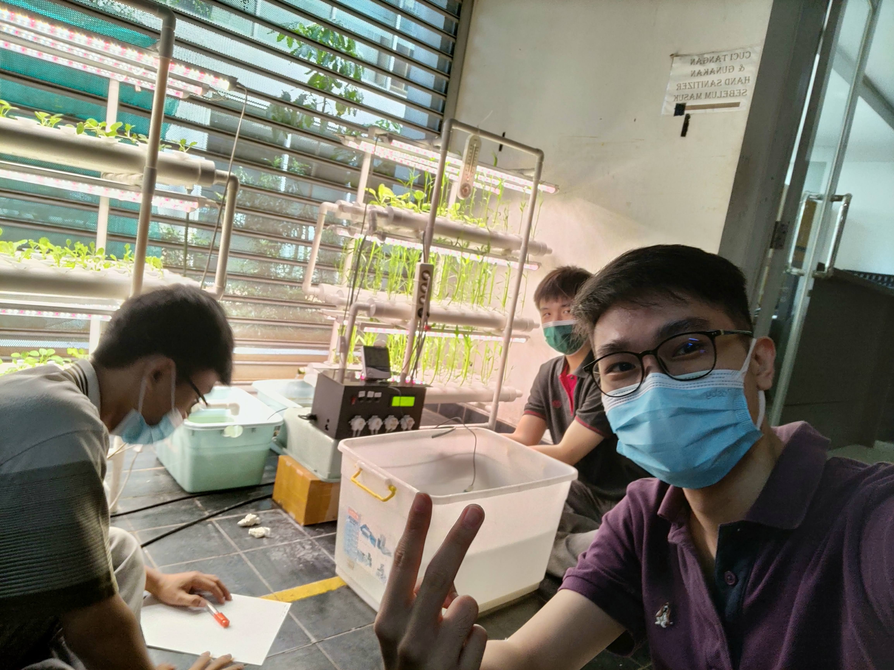

> This internship was done in my 7th semester of undergraduate study.

## About Baran Energy

Baran Energy is an Indonesian startup that focuses on developing energy storage systems, electric motorcycles and an agriculture division named Baran Farm. The Baran Energy office is located in Foresta Business Loft, BSD City.

## My Experience

Baran Energy is the first internship I have done in my life. At first I was nervous to start working at the company, but the supportive environment and the warmth of the team quickly put my apprehensions to rest. I had the opportunity to work in Baran Farm division alongside Nicholas Sanjaya, a colleague from university, and collaborated with the backend-frontend team and the agriculture specialist, Mr. Agung.

I was tasked with a project to make a hydroponics automation system. The created system should control the nutrition of the plants and add nutrition and water as needed by the users' requirements. After several initial research concerning the requirements and constraints with Mr. Agung, I designed the software, while my partner Nicholas designed the hardware for the system, after which we created the prototype and tested it together with Mr. Agung. I received a lot of feedback for the system from my company supervisor, Mr. Natanael, head of division Mr. Iqbal and my university supervisor, Mr. Surya for which I am very grateful. 

While periodic testings were done to understand the stability and performance of the system, the end result of the system was tested with real plants planted in a hydroponic system, and the project was presented for the university internship assessment.

## Afterwords

I am deeply grateful to Baran Energy, both the company and the people, for my internship experience with them as it allowed me to collaborate and participate in the development of the hydroponics automation system. This experience was also a great opportunity to broaden my knowledge of the world around me, since the out-of-campus nature of the internship allowed me to discuss (and sometimes debate) problems with other people outside of my comfort zone. I finished this internship with a sense of accomplishment, a network of amazing professionals, and a strong foundation for my future endeavors. The lessons I've learned and the memories I've made during this internship will undoubtedly influence my career path positively.
