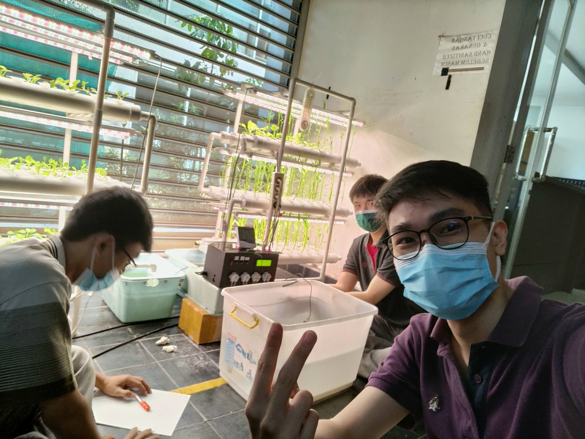

> 本次实习是在我本科第七学期完成的。

## 关于 Baran Energy

Baran Energy（PT. Aldebaran Rekayasa Cipta）是一家印度尼西亚初创公司，专注于开发储能系统、电动摩托车以及农业部门（Baran Farm）。公司办公室位于 BSD City 的 Foresta Business Loft。

## 我的经历

Baran Energy 是我人生中的第一次实习经历。在刚开始时，我对踏入这一新阶段感到有些紧张，但团队中友好且支持性的氛围很快消除了我的不安。我很幸运被分配到 Baran Farm 部门，与我的大学同学 Nicholas Sanjaya 一起工作。我们的合作还涉及后端与前端团队，以及农业专家 Agung 先生。

在这个项目中，我负责开发一个水培自动化系统。该系统旨在根据用户设定调节植物营养，并自动分配养分和水。与 Agung 先生合作期间，我们进行了大量研究，以明确项目需求与限制。随后，我主要负责软件设计，而我的同事 Nicholas 则负责硬件部分。在 Agung 先生的指导下，我们共同构建了原型并进行了测试。

在项目过程中，我从多个方面获得了宝贵的反馈，包括公司导师 Natanael 先生、部门主管 Iqbal 先生以及我的大学导师 Surya 先生。我非常感谢他们在整个过程中给予的指导与支持。

在开发过程中，我们定期进行测试，以评估系统的稳定性和性能。最终，我们通过在真实水培环境中使用植物来验证系统的效果。该项目随后作为大学实习评估的一部分进行展示，体现了我们工作的实际应用成果。

## 后记

我由衷感谢 Baran Energy 以及公司中的每一位成员，让我在参与水培自动化系统开发的过程中获得了宝贵的实习经验。这次机会不仅让我参与了一个有意义的项目，也让我对校园之外的世界有了更深入的理解。与不同背景的人交流，甚至进行讨论与辩论，使我学会以更批判性和多元化的视角看待问题。

完成这段实习让我充满成就感，也让我建立了宝贵的人脉，并为未来的发展打下了坚实基础。这段实习中的收获与回忆，无疑将对我的职业道路产生积极而深远的影响。

