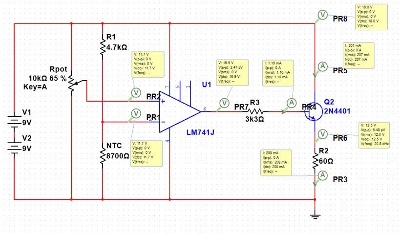
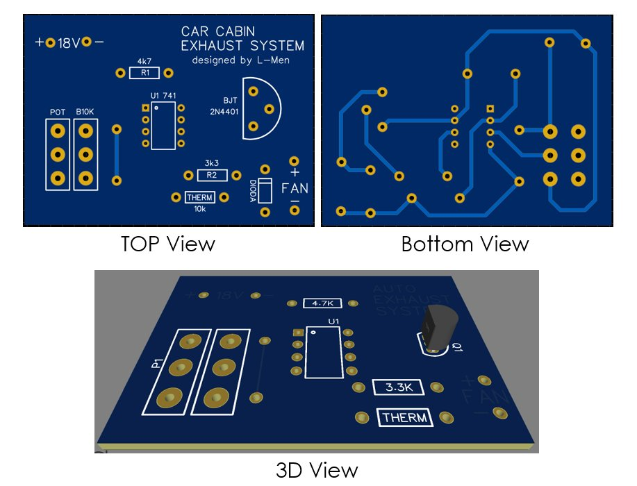
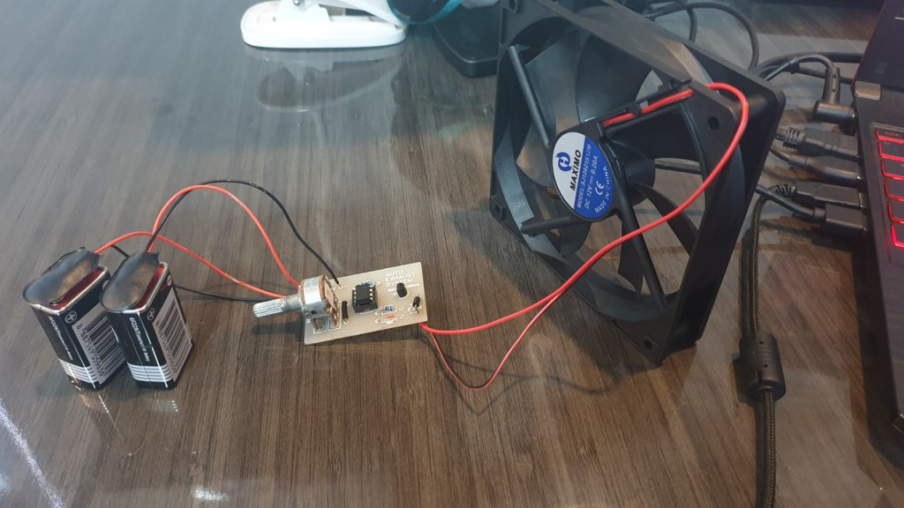

>This project was made for _Circuits and Signals, Electronic Devices Project_. This was finished in my 3rd semester of undergraduate study.

## Background

Temperatures in Jakarta can reach up to 34&deg;C. Under direct sunlight, the interior of parked cars are even more dangerous, with temperatures reaching up to 70&deg;C. Moreover, the chemical reactions from materials inside the cabin may cause heat stroke and cancer.

## Solution

We created a simple analog system to exhaust gases from the cabin. When temperatures inside the car reach 28&deg;C, a fan will start spinning, forcing air to move out of the car.

## Prototype

