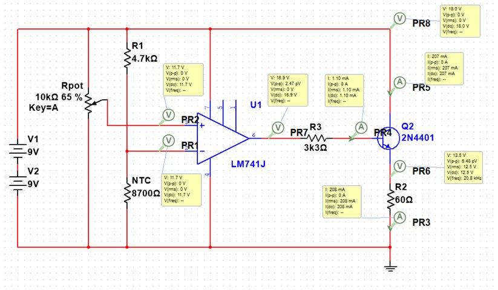
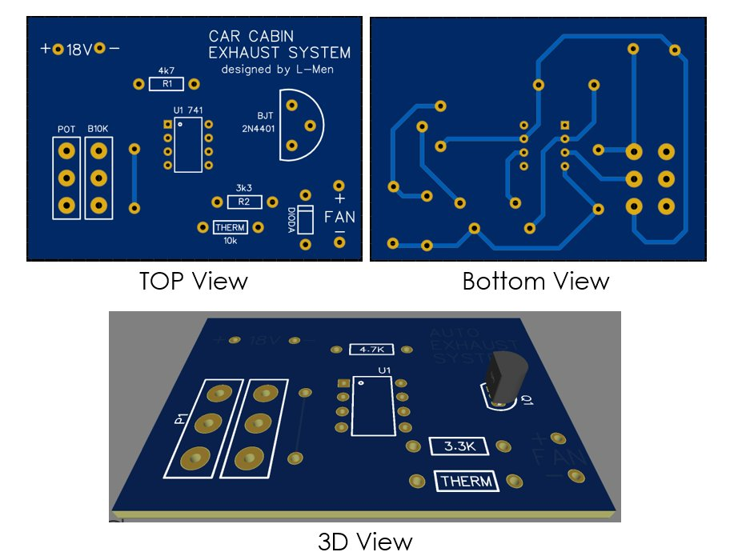
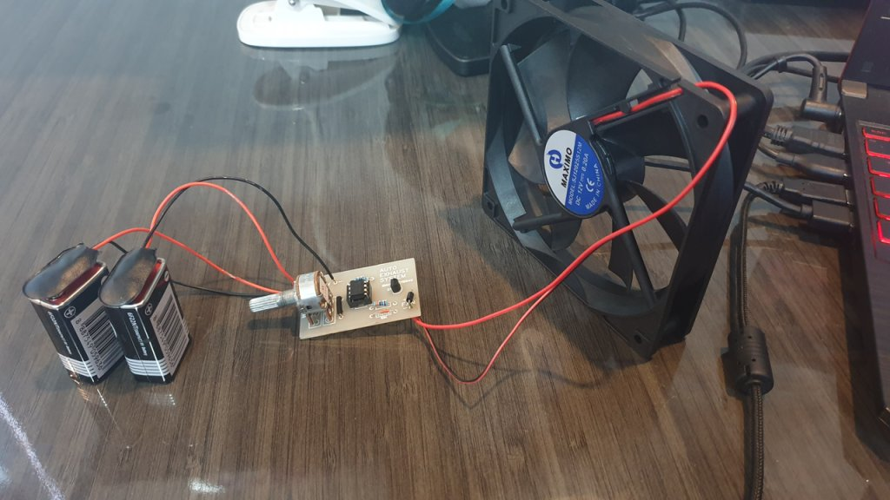

> 本專案為我大學第三學期《電路與訊號、電子元件專題》課程專案。

## 背景

雅加達氣溫最高可達 34°C。在陽光直射下，停放車輛的車內溫度甚至可能達到 70°C。此外，車內材料的化學反應可能對人體健康造成影響，增加中暑與致癌風險。

## 解決方案

我們設計了一個簡單的類比電路系統，用於排出車內空氣。當車內溫度達到 28°C 時，風扇會自動啟動，將車內空氣強制排出。

## 原型

