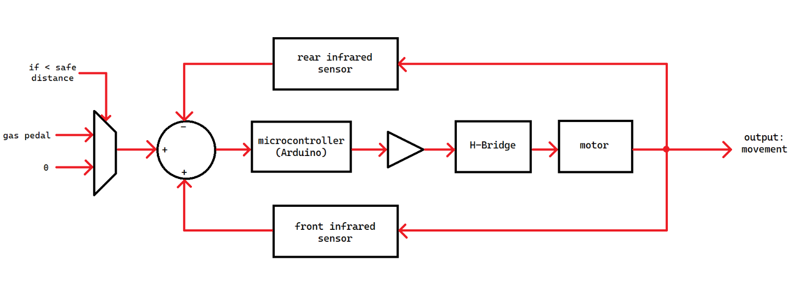
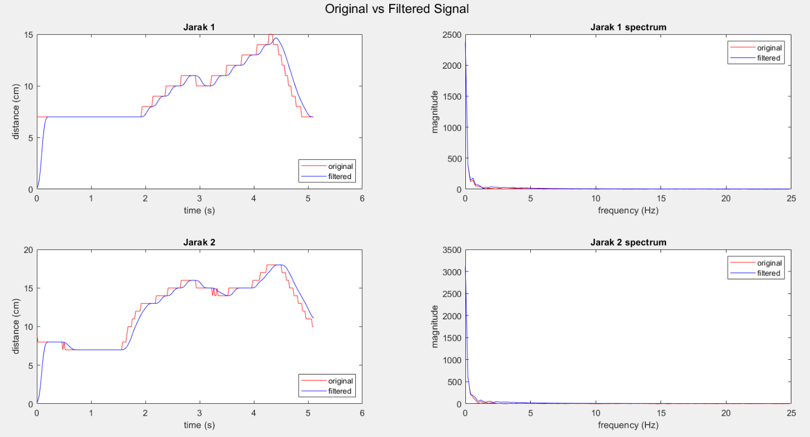

>This project was made for _Advanced Control System, Digital Signal Processing_ final exam. This was finished in my 5th semester of undergraduate study.

## Background

According to Badan Pusat Statistik, there are 15.800.933 passenger cars that accounts for 11.59% of all motor vehicles in Indonesia. In 2019, there were 116.411 cases of traffic accident, of which 25.671 people died. This high mortality rate from traffic accidents is a very serious problem, and precautions need to be taken to solve this problem.

## Solution

Our proposed solution is using a distance sensor that automatically reduces the speed or stop the car as necessary to avoid collision. This system should be able to override the speed intended by the driver in order to prevent collision.

## Prototype

For the prototype, we used Arduino Uno, 2 IR Distance Sensors for both rear and front side of the car, DC motor, L298N H-Bridge and rechargeable batteries.

PID control is used for the movement of the car prototype. The optimized PID coefficients are obtained from experiments. Digital signal from sensors are filtered using FIR filter designed with Hamming window method and the resulting signal was analyzed with Fast Fourier Transform (FFT).

Here is the prototype:



And here is the demonstration: 



The presentation slides for this project can be found [here](https://drive.google.com/file/d/1529pCAZztNKZ6Sh6hqMawIYgnN5aZJWL/view).