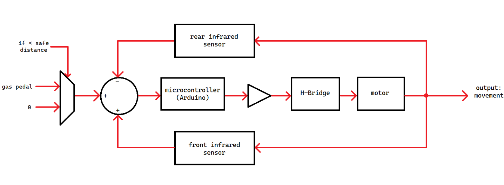
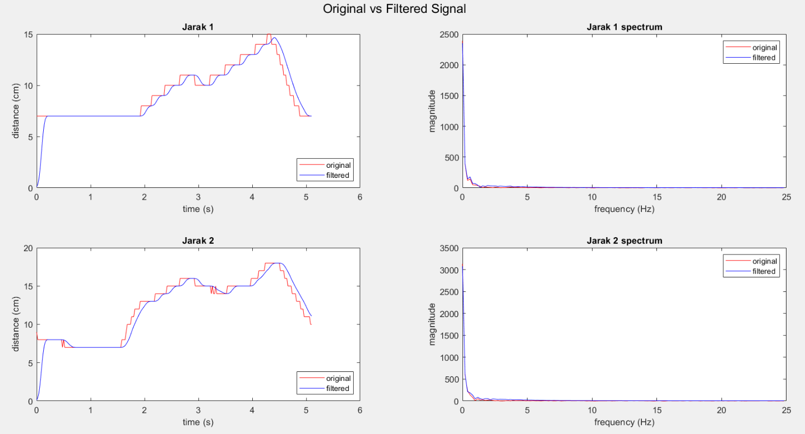

> 本项目为我本科第五学期《高级控制系统与数字信号处理》课程期末项目。

## 背景

根据印度尼西亚中央统计局（Badan Pusat Statistik）数据，印尼共有 15,800,933 辆乘用车，占全国机动车总数的 11.59%。2019 年交通事故共发生 116,411 起，其中 25,671 人死亡。如此高的交通事故死亡率是一个严重的社会问题，需要采取有效的预防措施。

## 解决方案

本项目提出一种基于距离传感器的自动控制系统，可在必要时自动降低车速或停车以避免碰撞。该系统能够覆盖驾驶员的速度输入，从而优先保证安全。

## 原型

本原型使用 Arduino Uno、前后各 1 个红外距离传感器、直流电机、L298N H 桥驱动模块以及可充电电池。

系统采用 PID 控制实现车辆运动，并通过实验对 PID 参数进行优化。传感器的数字信号经过基于汉明窗方法设计的 FIR 滤波器处理，并使用快速傅里叶变换（FFT）进行频谱分析。

原型展示如下：



演示视频如下：



本项目的展示幻灯片可在此查看：[链接](https://drive.google.com/file/d/1529pCAZztNKZ6Sh6hqMawIYgnN5aJWL/view)

