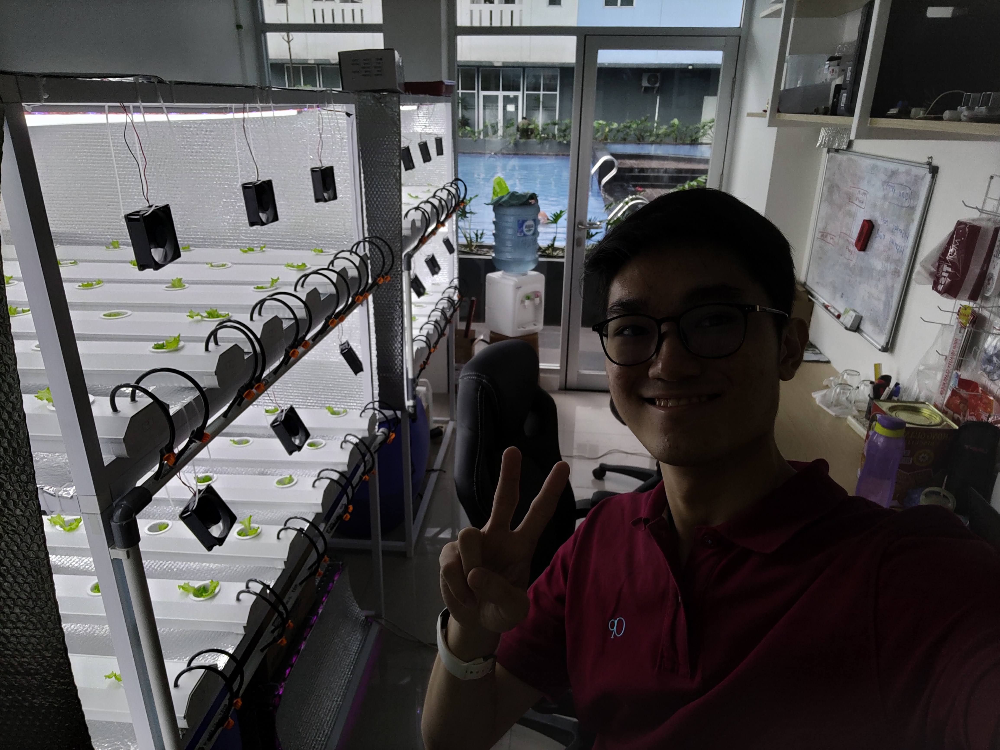

## About Daun Pintar

Daun Pintar is a hydroponics automation system startup founded in 2022. Daun Pintar has released 2 lines of products: the H series for small scale hydroponics and the G series for larger scale hydroponics.

## My Experience

Daun Pintar was found by the Baran Farm head of division, Mr. Iqbal. After [my internship at Baran Energy](/p/baran-internship), Mr. Iqbal offered me, Nicholas and Mr. Agung a job at this company. With our combined experience, we created a more sophisticated hydroponics automation system, along with several real-life testings. I developed a more sophisticated control system for the nutrition control and added some other features while keeping the ease of use in mind with the addition of mobile app integration.

Some of the memorable things during my time at this company were testing at Agro Edu Wisata Ragunan, a government-owned agricultural education park and the sale of products to a farm in Kalimantan, where we received feedback from people outside of the company. The harsh real-life environment condition during testing forced us to rethink our approach to the problem, adding more insights for development.

## Afterwords

I learned many valuable lessons in this company, such as the importance of discussion, careful and thoughtful approach to a problem and responsibility to the user. In the end, my tenure at Daun Pintar was cut short due to my responsibilities as a student. Nevertheless, I feel accomplished for my time at this company and am grateful for the whole experience.