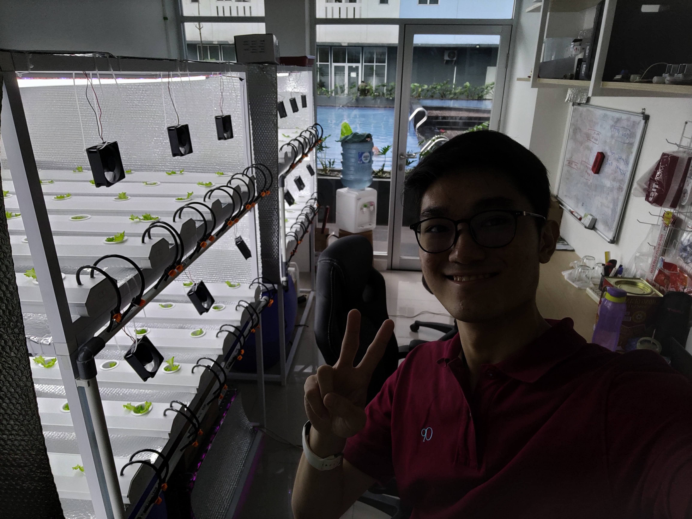

## 關於 Daun Pintar

Daun Pintar 是一家成立於 2022 年的水耕自動化系統新創公司，已推出兩條產品線：針對小型水耕的 H 系列，以及針對大型水耕的 G 系列。

## 我的經歷

Baran Farm 部門主管 Iqbal 先生同時也是 Daun Pintar 的創辦人。在完成我於 Baran Energy 的實習後，Iqbal 先生邀請我、Nicholas 以及 Agung 先生加入 Daun Pintar。

憑藉我們共同的專業背景，我們設計了一套更先進且穩健的水耕自動化系統。我負責升級營養控制系統，在增加功能的同時強調使用者友善性，並將其整合至行動應用程式。

在公司期間，一些重要經驗包括於 Agro Edu Wisata Ragunan（政府農業教育園區）進行測試，以及向加里曼丹的一間農場進行銷售。這些經驗讓我們獲得來自外部使用者的實際回饋。真實環境中的測試也促使我們重新檢視問題解決方式，並獲得重要的改進洞見。

## 後記

在 Daun Pintar 的工作期間，我學到了許多重要課題，包括開放討論的重要性、嚴謹的問題分析方式，以及以使用者為中心的責任意識。由於學業因素，我的任期較短，但我仍對這段經歷深感感激，並為能參與其中感到榮幸。
