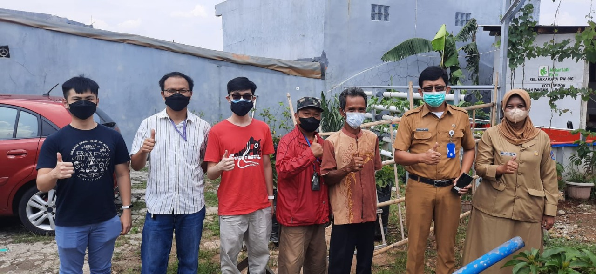
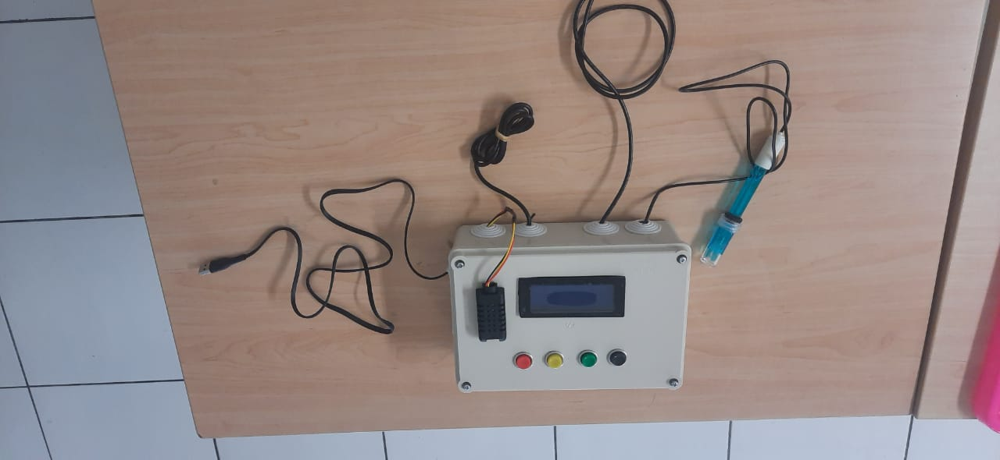
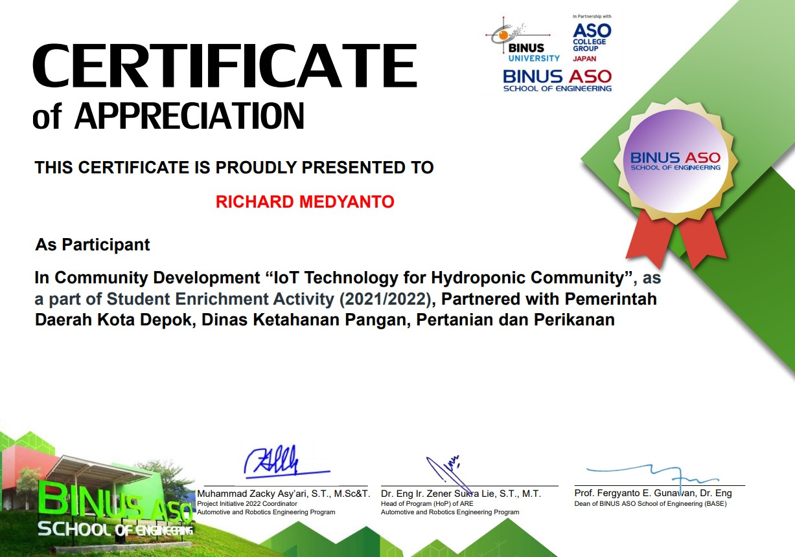

## Background

This project was done in collaboration with Depok City Regional Government, Department of Food Security, Agriculture and Fisheries. Initiated by Mr. Muhammad Zacky Asyari, a lecturer at BINUS ASO, I joined this project and developed the parameter control and camera monitoring using ESP32 and ESP32-cam. Other members of the project include 12 other members from my university, which worked on different aspects of the project such as dashboard design, prototype creation and community training.

## Observation

Before creating the system, I was invited to join Mr. Zacky in obvserving some hydroponics farm in Depok with Depok City government officials. After visiting some farms and meeting with the owners, it was found that the lack of human workers caused plants to die due to lack of nutrition when the workers went on vacation. This project was created to automate the nutrition addition process and do monitoring of hydroponics plants parameters.

## System

The system uses TDS and pH sensors to detect the water condition for the plants, temperature and humidity sensor to monitor the environment around the plant and ultrasonic sensor to monitor the water height in the water supply tank. To control the nutrition and acidity required by the plants, a 20x4 screen is used to show the parameters which users can control by using the 4 buttons below the screen. 4 pumps are used to add nutrition and pH up/down, controlled using relays connected to the microcontroller.

A dashboard was created using ThingsBoard to monitor the device using mobile devices. A separate system for camera monitoring was also planned, using ESP32-cam to capture and upload pictures of plants to Google Drive and monitor the conditions of the plant.

## Certificate

