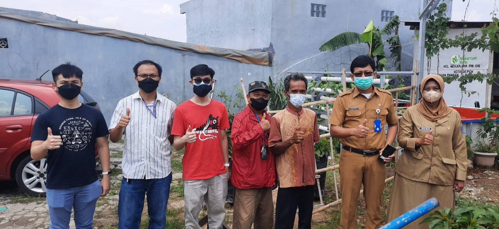
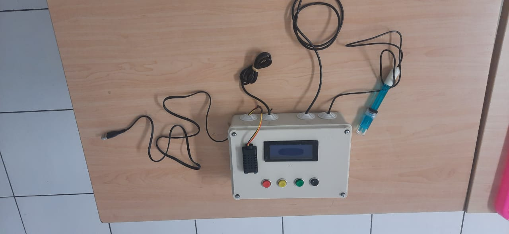
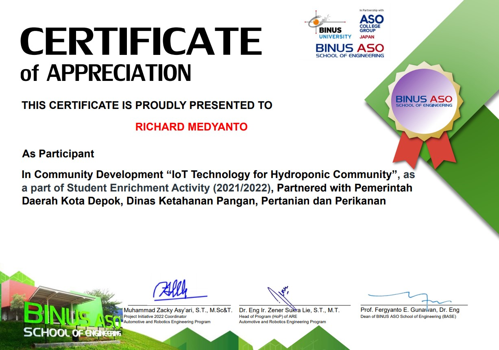

## 背景

本專案與德波市地方政府食品安全、農業與漁業局合作完成。專案由 BINUS ASO 講師 Muhammad Zacky Asyari 發起。我參與此專案，負責基於 ESP32 與 ESP32-CAM 開發參數控制與攝影監控功能。團隊共有來自本校的 12 位成員，分別負責儀表板設計、原型製作與社區培訓等不同工作。

## 調查

在系統開發前，我曾隨 Zacky 老師與德波市政府官員一同前往當地水耕農場進行實地調查。透過參訪多個農場並與農場主交流後發現，由於人力不足，當工作人員外出休假時，植物會因缺乏營養供應而枯死。

因此，本專案旨在自動化水耕營養添加流程，並監測水耕植物的環境與參數。

## 系統

系統使用 TDS 與 pH 感測器偵測植物水質狀態，並使用溫濕度感測器監控環境條件，另以超音波感測器監測儲水槽水位。

為了控制植物所需的營養與酸鹼度，系統採用 20×4 LCD 顯示器顯示參數，使用者可透過螢幕下方的 4 個按鍵進行調整。系統透過繼電器控制 4 個幫浦，用於添加營養液以及 pH 上升/下降溶液。

此外，我們使用 ThingsBoard 建立儀表板，以便透過行動裝置監控系統狀態。另一個子系統則使用 ESP32-CAM 拍攝植物影像並上傳至 Google Drive，以進行遠端監測。

## 證書

