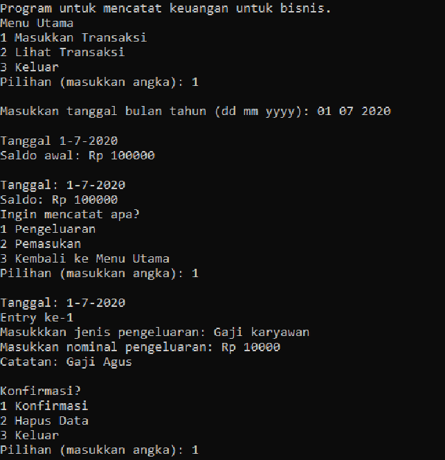
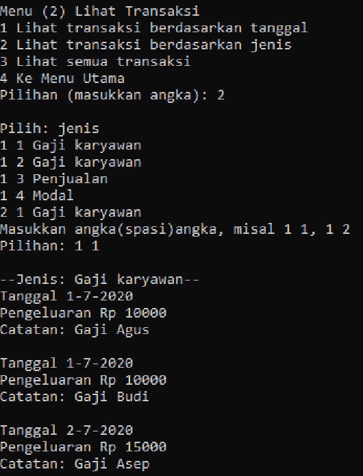

>This project was made for _Algorithm and Programming Fundamentals_ course final exam in my 2nd semester of undergraduate study.

## Background

Financial records are pretty hard to manage. Many people, even businesses still keep them in paper, which need manual calculation of incomes and expenses. Some people who try to use existing financial recording apps can also find it difficult due to the abundance of features or functions available.

## Solution

This project's goal is to be a simple app for financial recording. The interface will be in CLI, and can save the records in a file. The program is written in C language.

## Result

Here are some screenshots from the app.

Source code: [Github](https://github.com/richardmedyanto/AAPF)