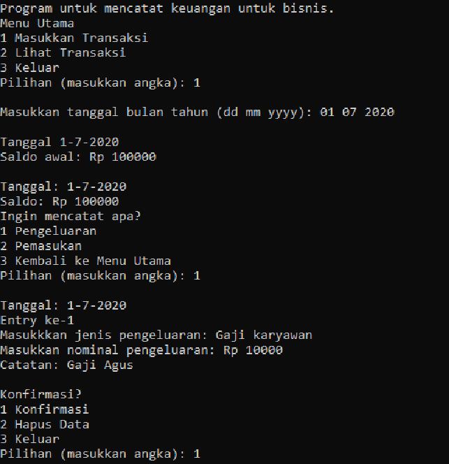
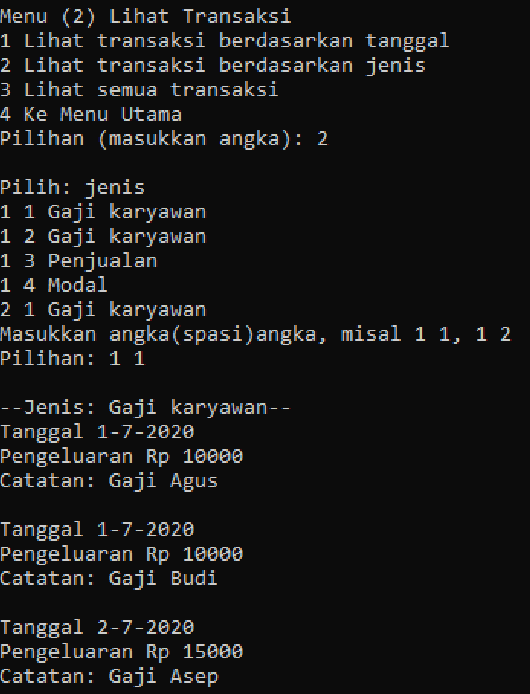

> 本项目为我本科第二学期《算法与程序设计基础》课程期末项目。

## 背景

财务记录的管理相对复杂。许多企业仍然使用纸质记录，需要手动计算收入与支出。而使用现有应用的人，也常常因为功能过多而感到难以上手。

## 解决方案

本项目的目标是开发一个简单的财务记录应用。该程序采用命令行界面（CLI），并能够将记录保存到文件中。程序使用 C 语言编写。

## 结果

以下是该应用的一些截图：

源码：[Github](https://github.com/richardmedyanto/AAPF)

