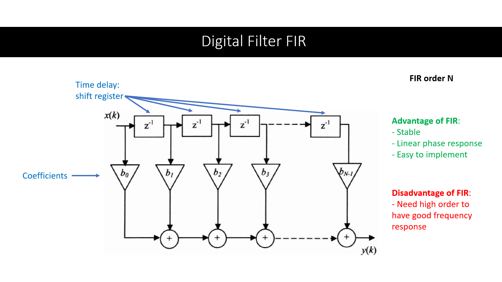
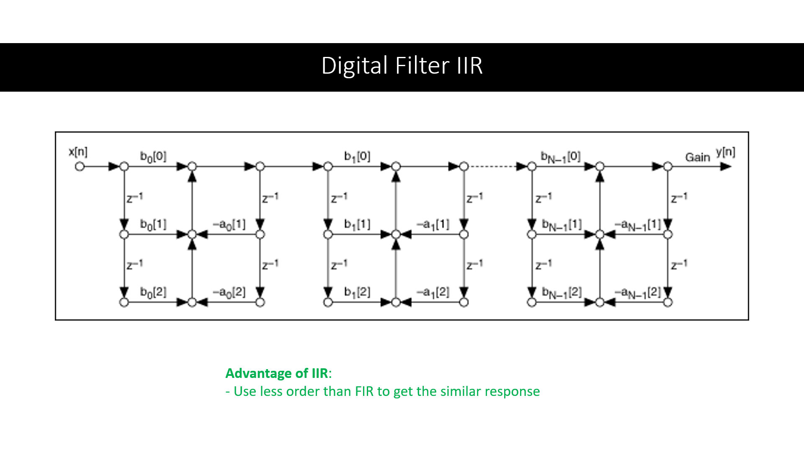
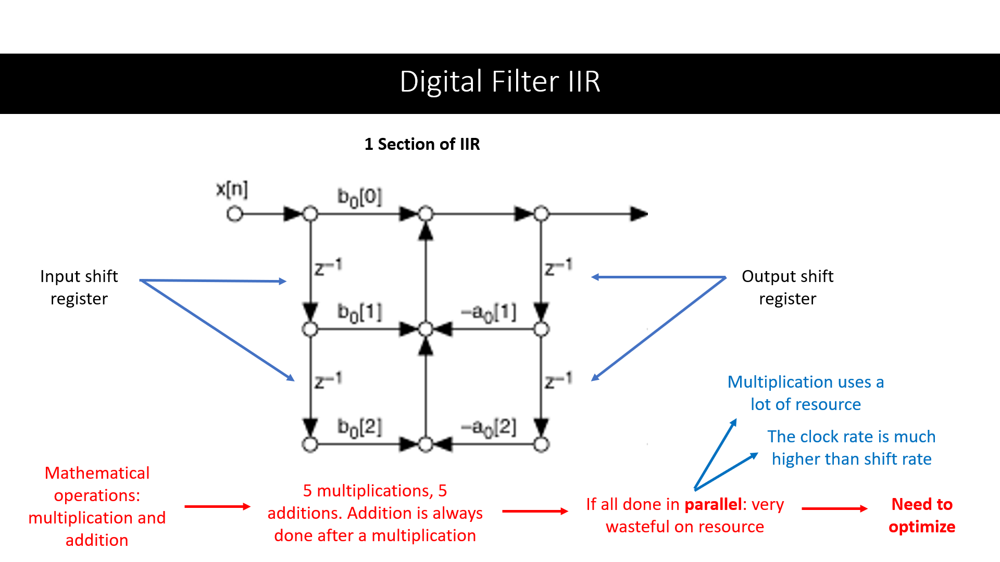
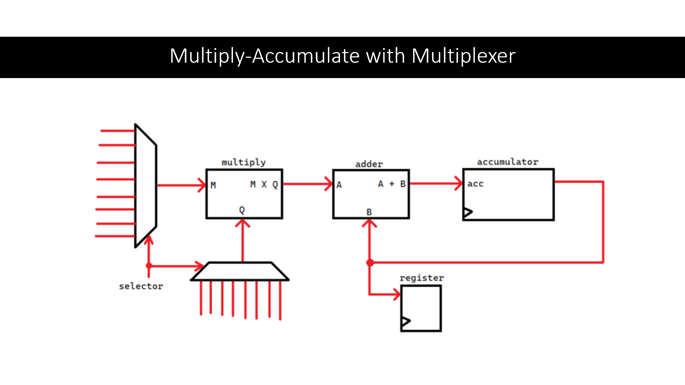

>This project is done during my time as a Digital System course lecturer assistant.

## Background

During my 5th semester of undergraduate study, I taught Digital Systems to 70 underclassmen as a lecturer assistant. My responsibilites included teaching and assisting with their projects. Under supervision of lecturer Mr. Ir. Sofyan, S.Kom., M.Eng., I taught the implementation of FIR (finite impulse response) and IIR (infinite impulse response) filters to assist with their final projects, which required an implementation of digital filters.

## Digital Filters and Optimization

Digital filters receive discrete inputs and output the filtered discrete signals. They can filter out some high-frequency signals, low-frequency or a specific band in the frequency spectrum. They are used to filter sensor inputs, in algorithms and many more. Some example of digital filters are FIR and IIR filters.

A FIR filter is easy to implement, using shift registers, multiplication and adder operations to output a filtered signal. A distadvantage of FIR is it requires high order to have a good frequency response. 

On the other hand, an IIR filter can achieve a good frequency response with lower order than FIR filters. This algorithm requires much less computation and memory than FIR filters with the same order to achieve a similar response. 

In the image above (a cascaded second-order sections form), multiplication and addition are performed. Normally, we can create a block for each of the multiplication and addition, like creating 5 multiplication blocks and 5 addition blocks for one section. However, that is very resource-intensive if done in parallel, as multiplication and addition require combinational systems, which would require a lot of logic gates (CPLD and FPGA boards have a limited number of combinational circuits).

We can take advantage of the clock rate, which is much higher than the shift rate. The required calculations can be done sequentially instead of in parallel. Instead of creating 5 multiplication blocks and 5 addition blocks, we can use a single multiply-accumulate block to do all the calculation in sequence. We can think of it as a single calculator device, used to do 10 calculations one after the other, instead of using 10 calculator devices to calculate all of them at the same time. Since we need to perform this calculation with input values from different places, we can use multiplexers to select the input to this multiply-accumulate block.

The final result is VHDL programs that implement the digital design of FIR filter and IIR filter based on the cascaded second-order sections form, which is optimized to use less resource. The gain coefficients for the filters can be obtained using MATLAB Filter Design and turned to binary numbers to fit the desired specifications. The VHDL files of the implementation can be inspected on [Github](https://github.com/richardmedyanto/DigitalSystem).

## Conclusion

The result is an implementation of order 7 FIR filter and order 6 IIR filter in VHDL, both with 8-bits of inputs and outputs. The optimized IIR filter uses sequential processing instead of combinational approach in multiply-accumulate.

## Class Slides

I created a slide for each session of the class. [Here is the link to those slides](https://drive.google.com/drive/folders/1CD6J7lh3XZlzTd88AjCnveswjOvHbajx?usp=sharing). The slide for the FIR and IIR implementation can be found in the Week 15 file in the folder.

## References

[FIR illustration](https://www.oreilly.com/library/view/digital-filters-design/9781905209453/ch007-sec002.html)

[IIR illustration](https://www.ni.com/docs/en-US/bundle/labview-digital-filter-design-toolkit-api-ref/page/lvdfdtconcepts/iir_sos_specs.html)