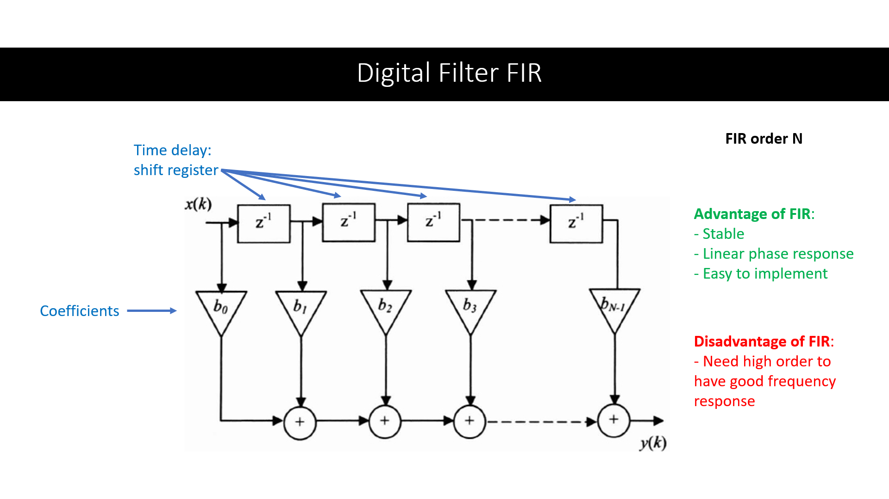
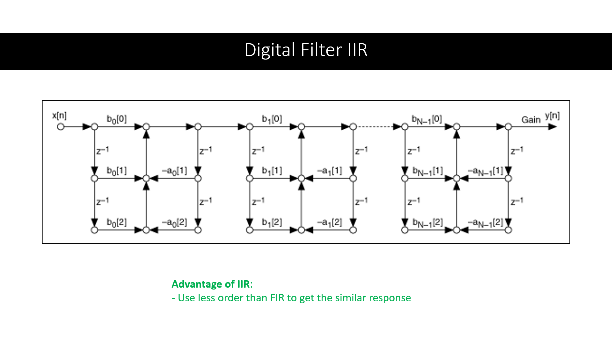
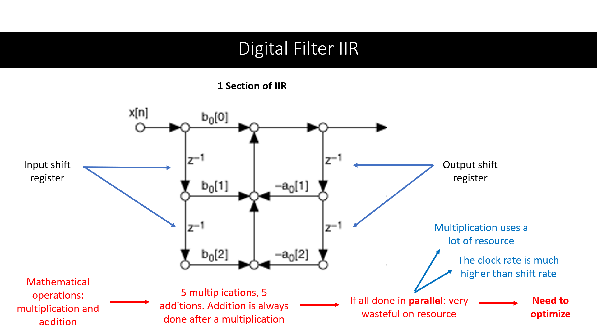
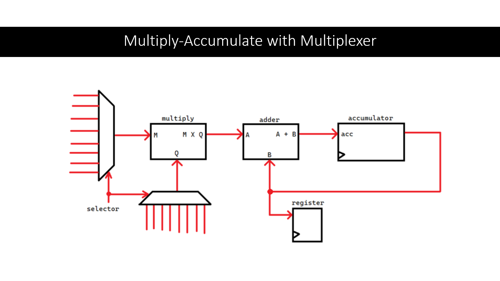

> 本项目是在我担任数字系统课程助教期间完成的。

## 背景

在本科第五学期期间，我作为课程助教为 70 名低年级学生教授数字系统课程。在任课教师 Ir. Sofyan, S.Kom., M.Eng. 的指导下，我负责教学与协助学生完成课程项目，主要讲解 FIR（有限冲激响应）与 IIR（无限冲激响应）滤波器的实现，以支持他们的期末项目开发。

## 数字滤波器与优化

数字滤波器接收离散输入并输出滤波后的离散信号，可用于滤除高频、低频或特定频段的信号，广泛应用于传感器处理与各类算法中。常见的数字滤波器包括 FIR 与 IIR。

FIR 滤波器实现较为简单，通常通过移位寄存器、乘法与加法实现滤波输出，但其缺点是为了获得良好的频率响应，需要较高阶数。

相比之下，IIR 滤波器在较低阶数下即可获得较好的频率响应，相较 FIR 具有更低的计算与存储开销。

在上述图中（级联二阶结构形式），系统需要进行多次乘法与加法运算。通常情况下，可以为每个运算单元设计独立硬件，例如一个 section 需要 5 个乘法器和 5 个加法器。但这种并行实现会极大消耗硬件资源，因为乘法与加法属于组合逻辑电路，在 FPGA/CPLD 上资源有限。

因此可以利用时钟频率远高于数据更新速率的特点，将原本并行计算改为顺序执行。通过一个乘加单元（multiply-accumulate, MAC）按顺序完成所有计算，而不是使用多个并行计算单元。这类似于用一台计算器依次完成 10 次计算，而不是使用 10 台计算器同时计算。由于输入来自不同路径，需要使用多路复用器（MUX）来选择输入源。

最终实现的 VHDL 程序基于级联二阶结构，实现 FIR 与 IIR 滤波器的数字设计优化版本，以减少硬件资源占用。滤波器增益系数通过 MATLAB Filter Design 计算，并转换为二进制以满足设计规格。完整 VHDL 代码可在 [Github](https://github.com/richardmedyanto/DigitalSystem) 查看。

## 结论

最终实现了 7 阶 FIR 滤波器与 6 阶 IIR 滤波器的 VHDL 设计，两者输入与输出均为 8 位。优化后的 IIR 滤波器采用顺序处理的乘加结构，而非纯组合逻辑实现。

## 课程讲义

我为课程每一节都制作了讲义幻灯片。可在此查看：[讲义链接](https://drive.google.com/drive/folders/1CD6J7lh3XZlzTd88AjCnveswjOvHbajx?usp=sharing)。FIR 与 IIR 实现内容位于文件夹中的第 15 周讲义。

## 参考资料

[FIR illustration](https://www.oreilly.com/library/view/digital-filters-design/9781905209453/ch007-sec002.html)

[IIR illustration](https://www.ni.com/docs/en-US/bundle/labview-digital-filter-design-toolkit-api-ref/page/lvdfdtconcepts/iir_sos_specs.html)
