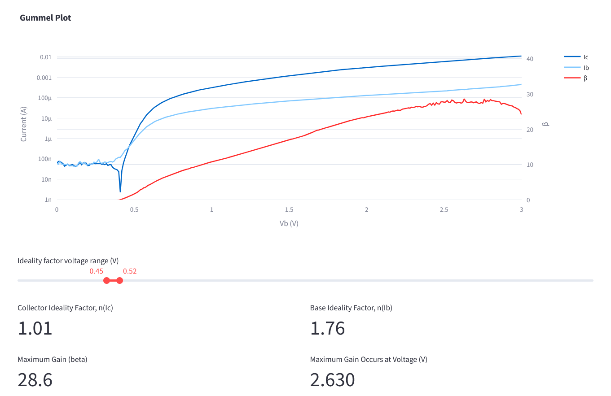
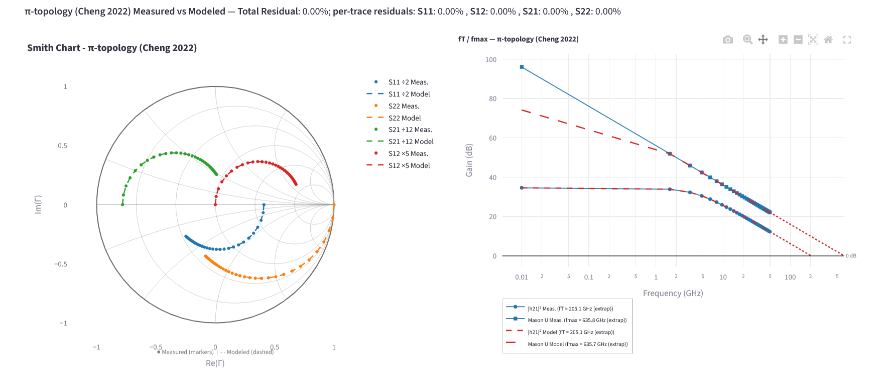

> 本專案於國立臺灣大學 IOED 實驗室完成

## 背景

HBT 的特性分析主要包含兩個面向：**直流（DC）分析**，透過 Gummel 曲線與輸出特性分析電流增益、理想因子與漏電流；以及 **射頻/交流（RF/AC）分析**，透過 S 參數量測擷取小訊號模型參數。在多個偏壓條件下手動進行這些分析既繁瑣又容易出錯，因此我開發了一套 Python 工具來自動化整個流程。

## IOED HBT Tools

**IOED HBT Tools** 是一個基於 [Streamlit](https://streamlit.io) 的 Web 應用程式，用於 HBT 的 DC 分析、RF 特性分析、小訊號模型（SSM）擷取與參數調校。此工具完全以 Python 開發，可於 [Streamlit 線上伺服器](https://hbt-tools.streamlit.app/) 或本地端執行。

原始碼已開源於 GitHub：
[ioedhbt/hbt-tools（IOED-Tools 分支）](https://github.com/ioedhbt/hbt-tools/tree/IOED-Tools)

## 直流分析

Gummel 分析模組可匯入量測得到的 Gummel 曲線資料，並將多個偏壓點疊加比較。基極與集極電流的理想因子可透過各曲線的對數-線性斜率自動擷取。

## 射頻擷取與小訊號模型擬合

RF 擷取模組可讀取多偏壓條件下的 `.s2p` S 參數檔案，進行開路/短路去嵌（de-embedding），並計算增益與穩定性指標，包括 |h₂₁|²、Mason 單向增益 U，以及 Rollett 穩定因子 K。接著依據 Cheng 等人（*Microelectronics Journal*, 121, 2022）的方法擷取小訊號等效電路模型。

之後，將擷取出的模型回擬至量測的 S 參數。下方的 Bode 圖/Smith 圖顯示擬合後的 S21 幅度與相位，證明模型與量測結果在頻率範圍內具有良好的一致性。

## GPU 加速參數調校

為了處理模型參數最佳化時龐大的組合搜尋空間，調校引擎支援透過 **CuPy 進行 CUDA 加速**。其實作包含自適應批次大小機制：根據可用顯存自動調整每次迭代的運算規模，在有餘裕時擴大批次，在發生記憶體不足時縮小規模，從而避免在 Windows WDDM 驅動下頻繁清除記憶體池。這使得大規模平行參數掃描成為可能，而僅使用 CPU 時幾乎無法實現。