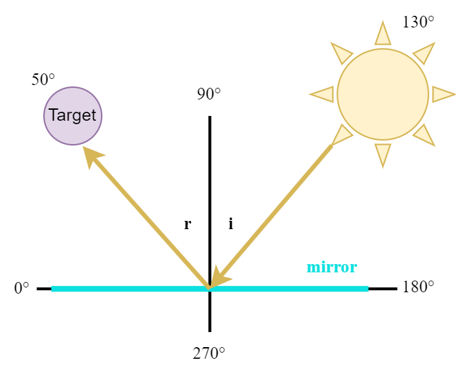
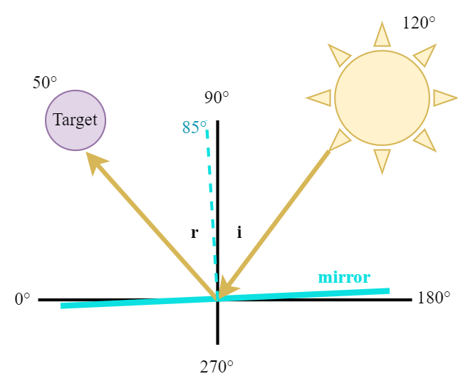
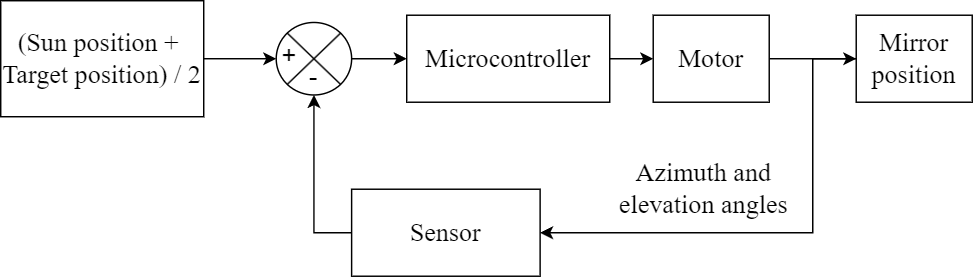
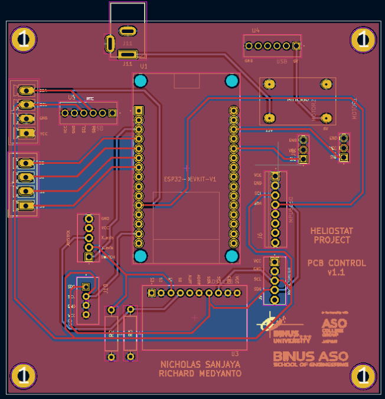
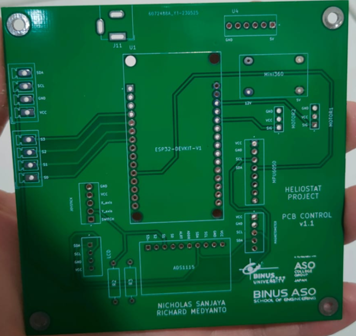
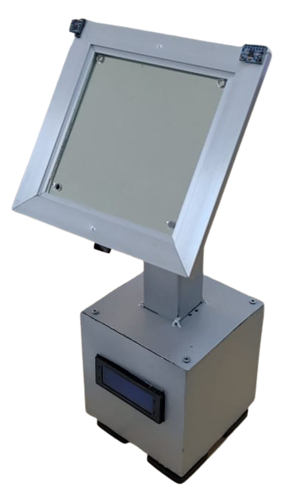
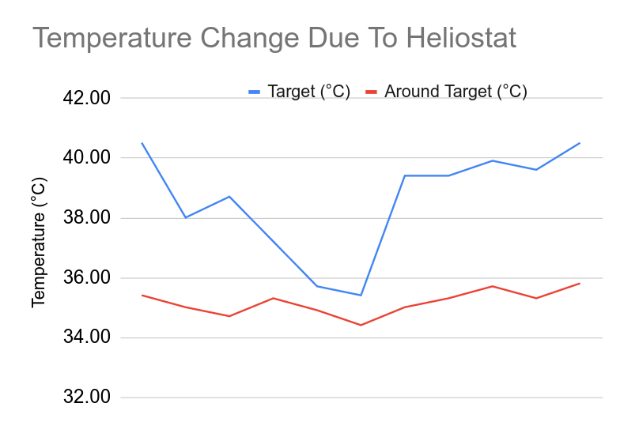

>This project was the capstone project for my undergraduate study. The research is documented in a paper and was presented in [ICEEI 2023](https://stei.itb.ac.id/iceei2023/).

## Background

Solar power is a source of renewable energy that is usually converted into electricity using photovoltaics (solar panels). The low efficiency of solar panel calls for the development of other alternatives, such as heliostats.

Heliostat is a device that reflects sunlight to a boiler in concentrated solar power systems to generate electricity. However, the high investment cost is the highest barrier for its development.

This research focuses on the development of a heliostat that keeps the reflection of the sunlight on a target throughout the day.

## Method

A heliostat works by moving a mirror in 2 axes: the azimuth axis and the elevation axis. These axes are also used to denote the position of the sun in a certain location at a certain time. 

The position of the sun at can be algorithmically determined with the [NOAA Solar Calculator](https://gml.noaa.gov/grad/solcalc/). After acquiring the sun position (in azimuth and elevation), the mirror can then be positioned to keep the reflection of the sun on the target.

 

The mirror should be positioned between the sun and the target. The system can then be represented in the following block diagram: 

The heliostat require an accelerometer and gyroscope sensor as well as a magnetometer sensor to detect the orientation of the mirror, which can be moved using servo motors.

This video I created in Desmos shows the desired behavior of the final product.



## Prototype

A PCB was designed for the electrical components needed by the device.

 

Then, everything was put together inside a case, as seen in the picture below.

## Results

We did a test to determine the performance of the heliostat in keeping the sunlight reflection on the target, as well as its heating effects on the target. Here's a demonstration video of the heliostat. Please feel free to turn on the caption.



The change in temperature due to the reflected sunlight is presented in the following graph.

## Conclusion

Heliostat can be controlled by determining the positions of the sun and target, then calculating the required mirror position. The created prototype successfully increased the temperature in the target.
