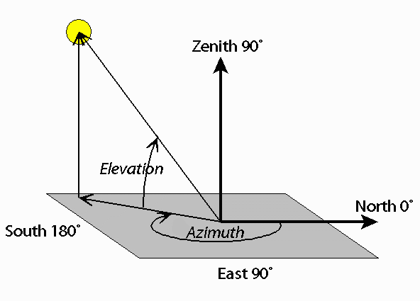
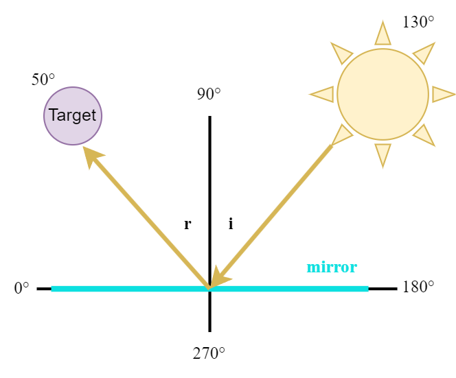
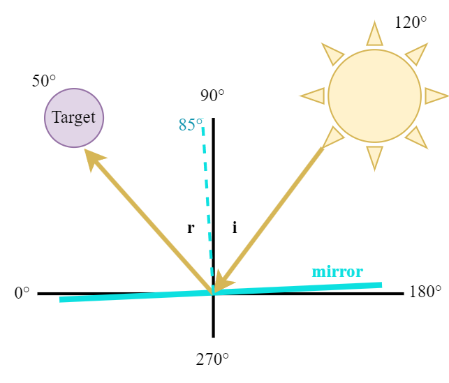
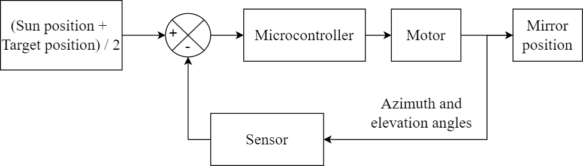
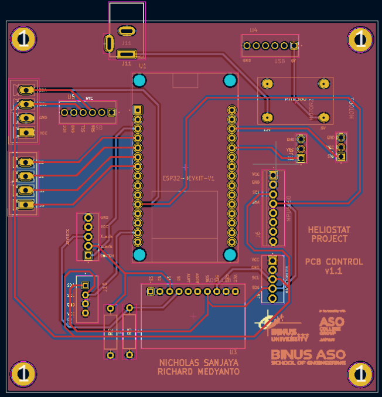
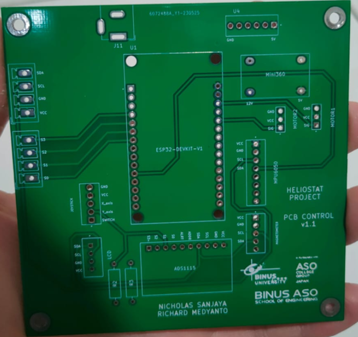
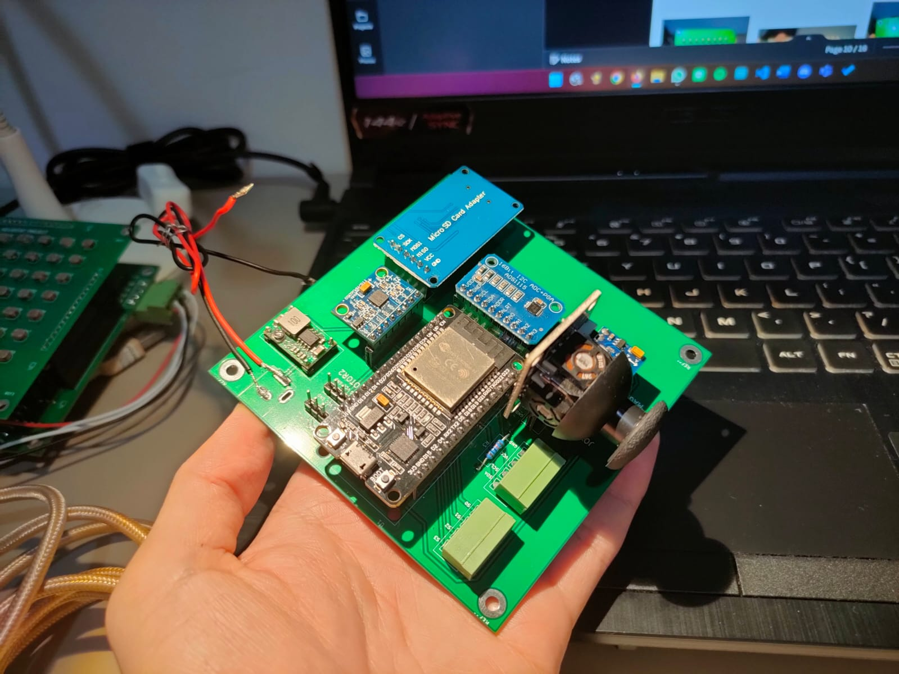
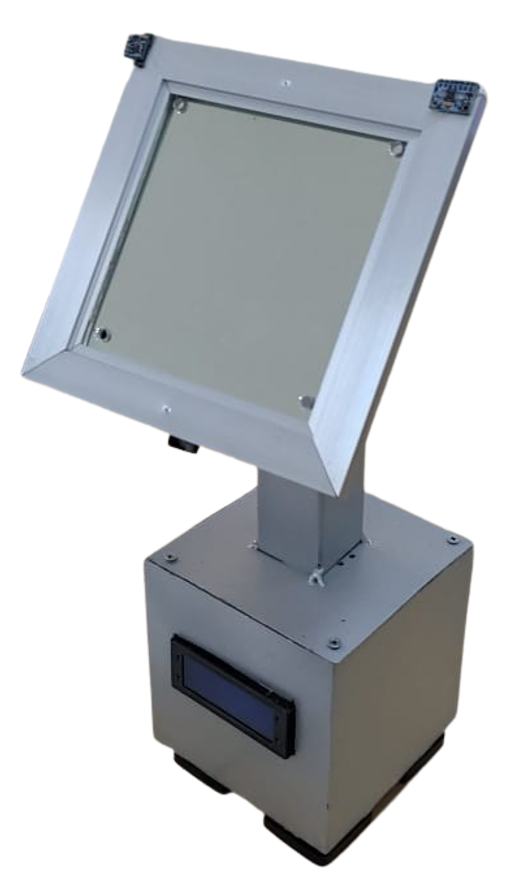
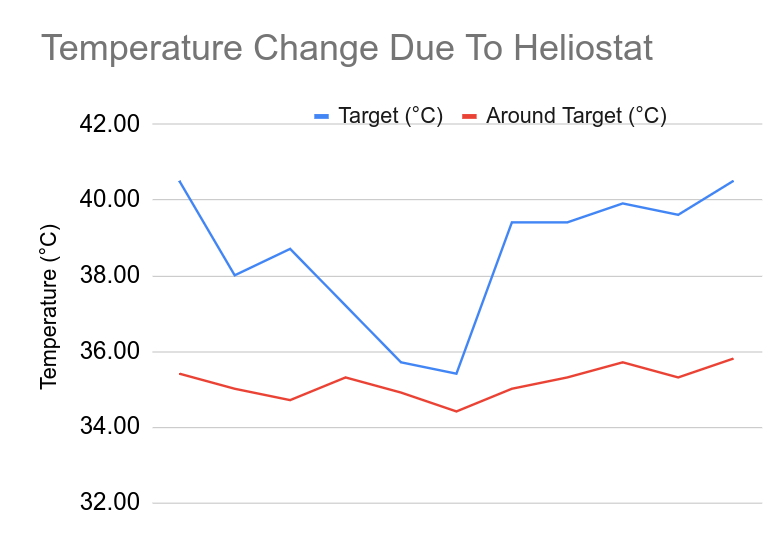

> 本專案為我的大學畢業專題。研究成果已於 [ICEEI 2023](https://stei.itb.ac.id/iceei2023/) 發表，並發表於論文（DOI：[10.1109/ICEEI59426.2023.10346650](https://doi.org/10.1109/ICEEI59426.2023.10346650)）。

## 背景

太陽能是一種再生能源，通常透過光伏（太陽能板）轉換為電能。然而，太陽能板的效率較低，因此促使人們尋找其他替代方案，例如定日鏡（heliostat）。

定日鏡是一種應用於聚光式太陽能發電（CSP）系統的裝置，透過將陽光反射至鍋爐來產生電力。然而，其高昂的投資成本仍然是發展上的主要障礙。

本研究旨在開發一種能夠在整天持續將陽光反射至目標的定日鏡系統。

## 方法

定日鏡透過在兩個軸向上移動鏡面來運作：方位角（azimuth）與仰角（elevation）。這兩個角度同時也用來描述特定時間與地點下的太陽位置。

太陽的位置可以透過 [NOAA Solar Calculator](https://gml.noaa.gov/grad/solcalc/) 進行演算法計算。取得太陽的方位角與仰角後，即可調整鏡面，使反射光持續照射在目標上。

 

鏡面應位於太陽與目標之間。系統可用以下方塊圖表示：

定日鏡需要使用加速度計與陀螺儀，以及磁力計來偵測鏡面姿態，並透過伺服馬達進行控制。

這是我在 Desmos 製作的動畫，展示系統的理想運作情形。紅線為鏡面，黃線為入射陽光，綠線為反射光。



## 原型

為此系統設計了 PCB 以整合所需的電子元件。

 

接著將元件焊接並組裝至外殼中，如下所示。

 

## 結果

我們進行測試以評估系統在維持陽光反射至目標的能力，以及其對目標的加熱效果。以下為定日鏡的示範影片（可開啟字幕）。



由反射陽光所造成的溫度變化如下圖所示：

## 結論

定日鏡可透過計算太陽與目標的位置來決定鏡面角度，進而控制反射光方向。所製作的原型成功提升了目標區域的溫度。
