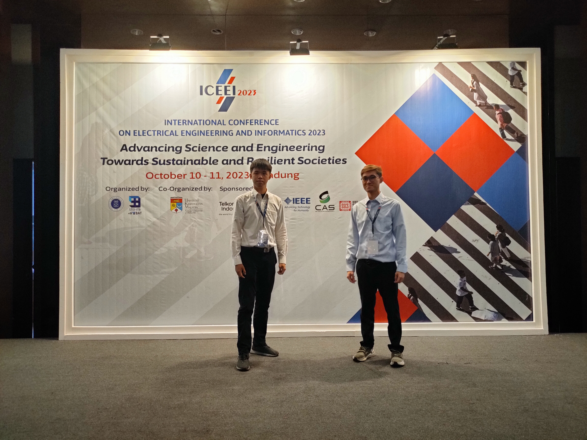
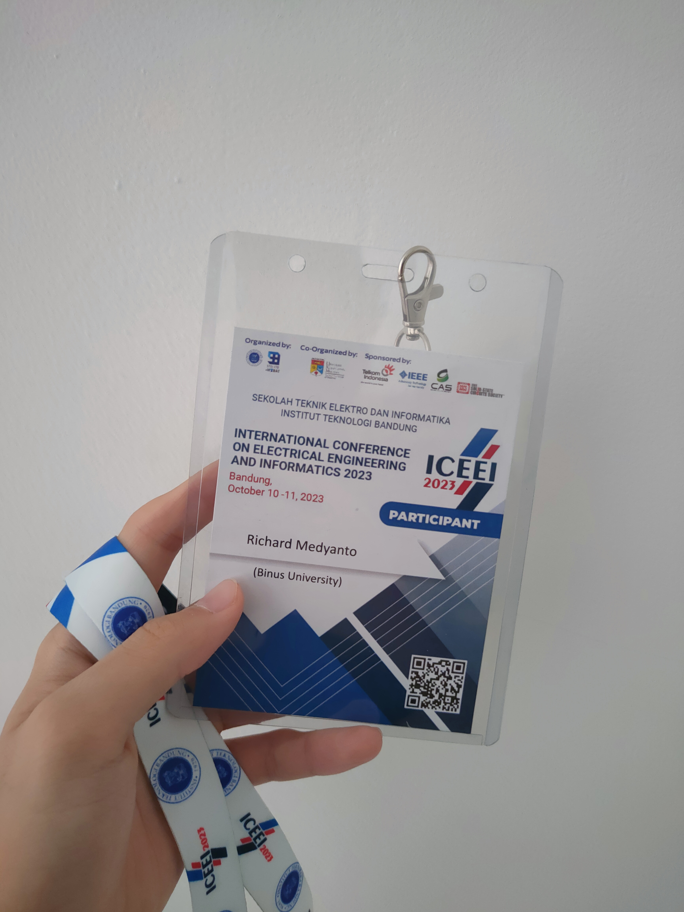

 

After finishing the [heliostat](/p/heliostat) project, me and my partner Nicholas decided to publish our research in a conference. We were informed about [ICEEI 2023](https://stei.itb.ac.id/iceei2023/), an engineering conference held in Bandung by ITB. We worked on the paper, sent it for review, received feedback, and submitted the revised paper.

ICEEI 2023 is our first engineering conference. The event was surprisingly attended by few people, with some groups of people from ITB, Malaysia and (my university) Binus ASO. We presented our research and listened to others' presentations. We quickly realized that the conference combines people from various backgrounds, some who are undergraduate students and some who are PhD students, whose research were admittedly too complex for my current knowledge.

Despite the few attendees, I feel that this event was a success. It showcases research from many people in many parts of the world and encourages discussion and improvement. I would definitely attend a similar conference again in the future.