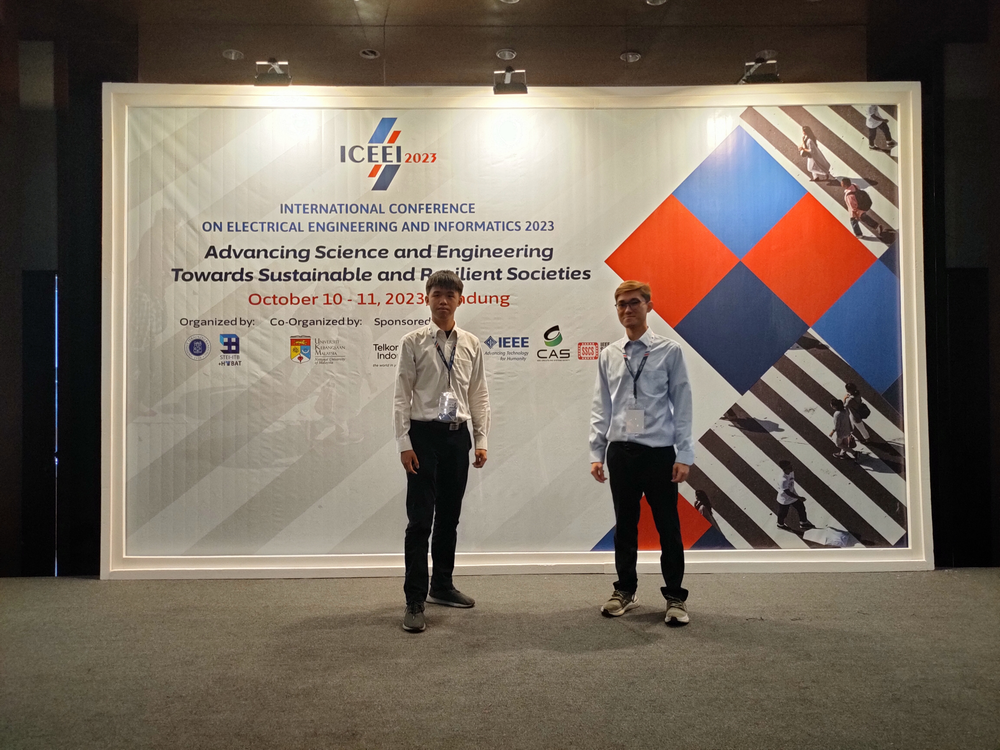
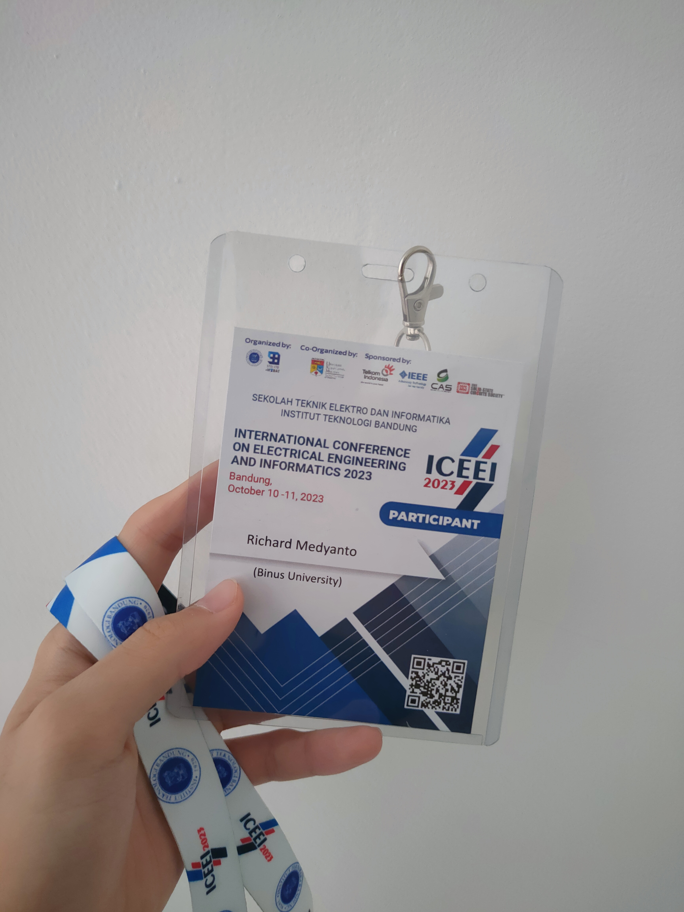

 

在完成 [heliostat](/p/heliostat) 项目之后，我和我的搭档 Nicholas 决定将我们的研究投稿到会议。后来我们得知了 [ICEEI 2023](https://stei.itb.ac.id/iceei2023/)，这是由万隆理工学院（ITB）在万隆举办的一个工程类会议。我们撰写了论文并提交评审，收到了反馈意见，并根据建议完成了修改稿的提交。

ICEEI 2023 是我们参加的第一个工程类会议。出乎意料的是，参会人数并不多，主要包括来自 ITB、马来西亚以及（我的学校）Binus ASO 的一些团队。我们进行了研究展示，也聆听了其他人的报告。很快我们就意识到，这个会议汇集了不同背景的人群，有本科生，也有博士生，其中一些研究内容对我目前的知识水平来说确实相当复杂。

尽管参会人数不多，我仍然认为这次活动是成功的。它展示了来自世界各地研究者的成果，并鼓励交流与改进。未来如果有类似的会议，我一定还会再次参加。
