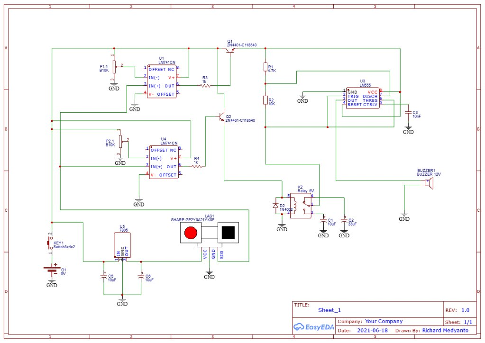
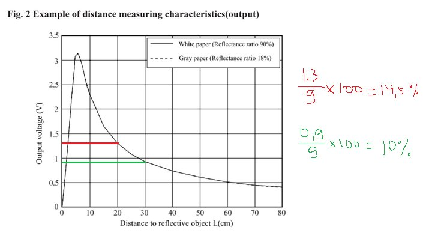
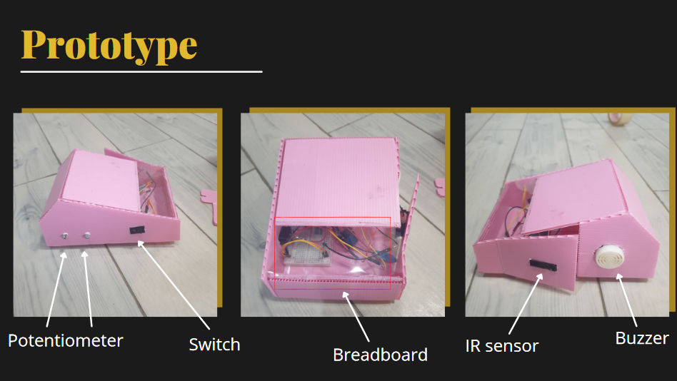

> This project was made for _Control System_ course final exam in my 4th semester of undergraduate study.

## Background

Hitting obstacles like walls, people, or another vehicle in the parking lot is sometimes hard to prevent just by looking. Ultrasonic sensors are commonly used in the front and rear of the car to detect the distance of obtacles, but these sensor are rarely located in the sides of the car. This group project aims to add infrared sensors on the sides of the car (with analog circuits, since that was the requirement for the course).

## Circuit Design

### Components Used
- 9V battery
- On/off Switch
- SHARP GP2Y0A21YK0F analog infrared sensor
- Resistors:
    - 2x 10k potentiometers
    - 2x 1kΩ
    - 1x 4.7kΩ
    - 1x 10kΩ
- Capacitors:
    - 1x 10 nF
    - 3x 10 uF
    - 1x 33 uF
- IC:
    - 2x LM741
    - 1x LM555
    - 1x 7805 Voltage Regulator
- 1x 5V relay
- 1x 1N4001 diode
- Buzzer

## How It Works

*Warning: getting technical*

**TL;DR**: The distance detected by the IR sensor is compared with 2 fixed distances. The closer the distance, the faster the alarm beeps.

The IR sensor will output an analog voltage if there is an obstacle between 10-80 cm from the sensor. The closer the obstacle, the higher the output voltage. This analog voltage is then compared with the potentiometers by 2 LM741 comparators. The upper one will output high when the distance is close, and the lower one will also output high when the distance is even closer. The potentiometers are turned to positions according to this rough calculation:

When only the upper comparator is on, the LM555 will output a 1.8 Hz square wave to the buzzer. This is because at this state, the LM555 uses the 33 uF capacitor connected to the normally open side of the relay pin.

When the obstacle is even closer to the sensor, the lower comparator will also turn on. This will trigger the relay, so that the LM555 will use the 10 uF capacitor connected to the normally closed side of the relay pin, and the buzzer will output a higher frequency sound, at around 5.8 Hz.

## Prototype

## Presentation
(In Indonesian)



[Link to presentation slides](https://www.canva.com/design/DAEXnbXfPTM/UMC_lzbS3-lSLgSNfd8P9g/view?utm_content=DAEXnbXfPTM&utm_campaign=designshare&utm_medium=link&utm_source=sharebutton)