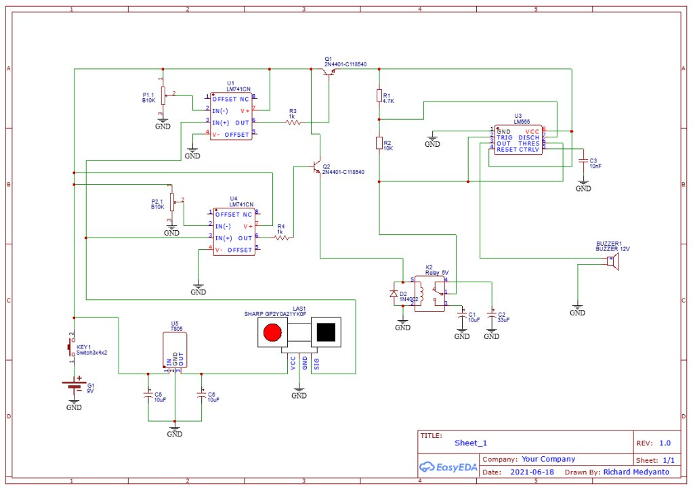
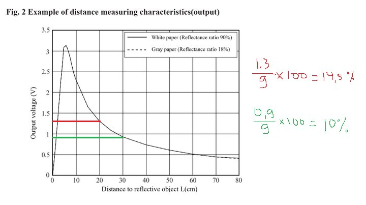
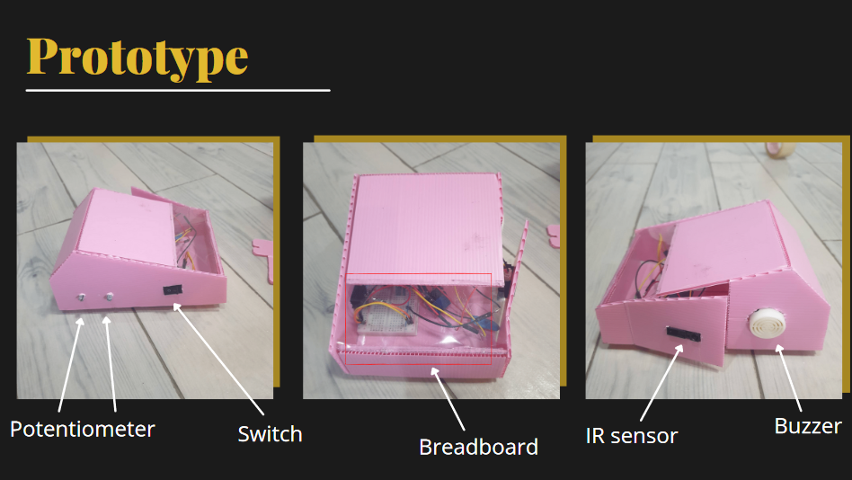

> 本專案為我大學第四學期《控制系統》課程期末專案。

## 背景

在停車場中，僅靠視覺有時難以避免碰撞到牆壁、行人或其他車輛。超音波感測器通常安裝於車輛前後以測量距離，但車身側面較少配置此類感測器。本小組專題目標是在車輛側邊加入紅外線感測器（由於課程要求，本設計採用類比電路實作）。

## 電路設計

## 工作原理

**簡要說明（TL;DR）**：紅外線感測器偵測到的距離會與兩個固定閾值進行比較。距離越近，蜂鳴器的警報頻率越高。

紅外線感測器在 10–80 cm 範圍內偵測到障礙物時會輸出類比電壓。障礙物越近，輸出電壓越高。該類比電壓再透過兩個 LM741 比較器與電位器設定的閾值進行比較。上方比較器在距離較近時輸出高電位，下方比較器在距離更近時也會輸出高電位。

電位器的設定位置依據如下近似計算：

當僅上方比較器導通時，LM555 會輸出約 1.8 Hz 方波驅動蜂鳴器。此時 LM555 使用連接至繼電器常開端的 33 μF 電容。

當障礙物更近時，下方比較器也會導通，進而觸發繼電器，使 LM555 切換至連接常閉端的 10 μF 電容，蜂鳴器輸出更高頻率約 5.8 Hz 的聲音。

## 原型

## 展示

（印尼語）



[簡報連結](https://www.canva.com/design/DAEXnbXfPTM/UMC_lzbS3-lSLgSNfd8P9g/view?utm_content=DAEXnbXfPTM&utm_campaign=designshare&utm_medium=link&utm_source=sharebutton)
