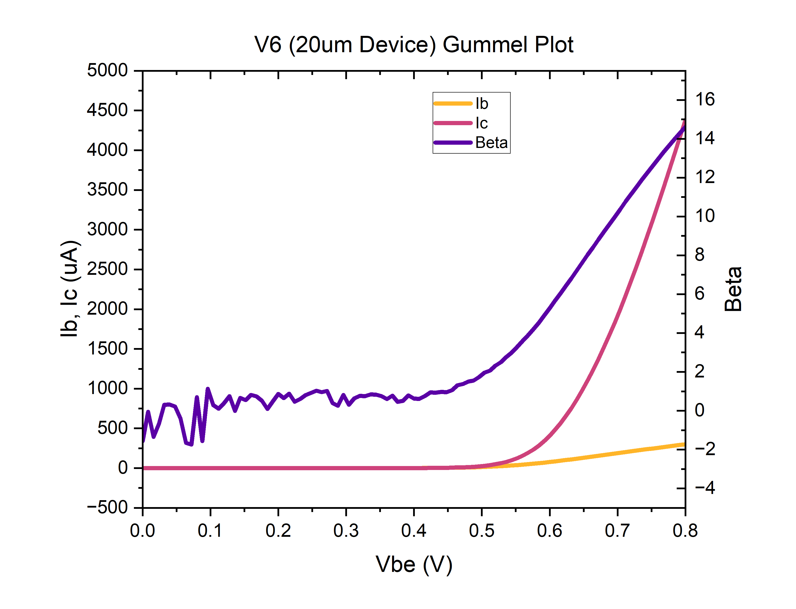
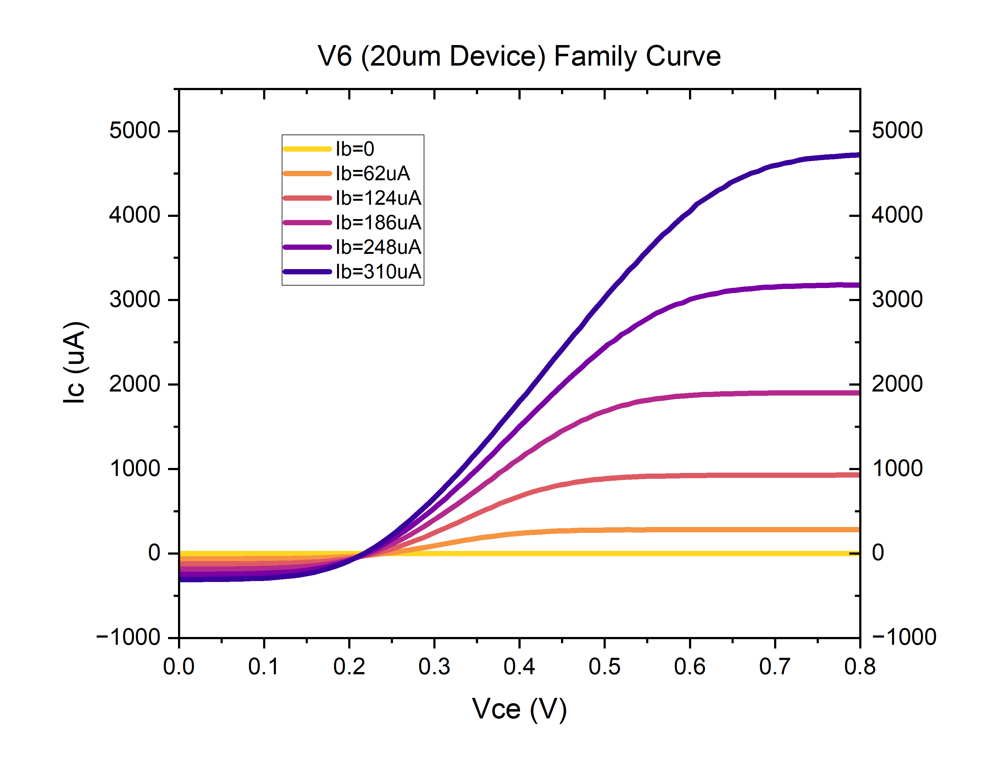

> This project was made in IOED Lab, NTU

## Background

**Heterojunction bipolar transistors (HBTs)** are a type of transistor that use different materials for different regions, instead of using one single material such as silicon. They use both electrons and holes to conduct current, as compared to FETs that use only one of them. The advantages of this heterojunction design, when compared to single-material-based transistors such as BJTs, are higher current gain, faster switching speed, higher power efficiency, and better design flexibility. These advantages make them the perfect devices applicable to high-frequency amplifiers and communication. One example application of terahertz InP HBTs is in generating or amplifying terahertz waves, which could help realize imaging systems that can see through certain materials.

## Devices

HBTs are comprised of three regions: emitter, base, and collector.

## Fabrication Process

The epitaxial structure of this device was grown on top of InP substrate. In our lab, we perform photolithography with MA6, wet etching to pattern the mesa, then deposited metal contacts. Annealing was performed to achieve ohmic contact with the semiconductor. 

## DC Measurement

The graphs below plot the gummel and family curves. In this round, we obtain the maximum gain (beta) of 14.6 on our 20um-sized emitter device.

## Future Work

Further process optimization are required to achieve an r.f. (radio frequency) device. Contact resistance of 1e-8 Ω-cm², passivation, and yield increase are key improvements we are working on at IOED Lab.