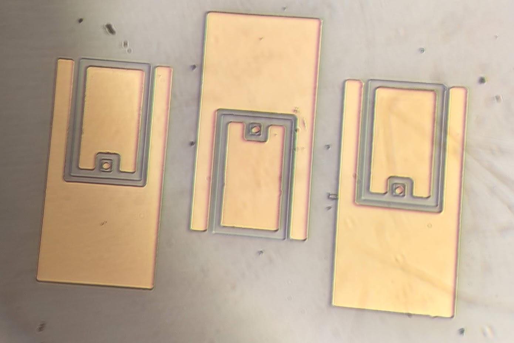
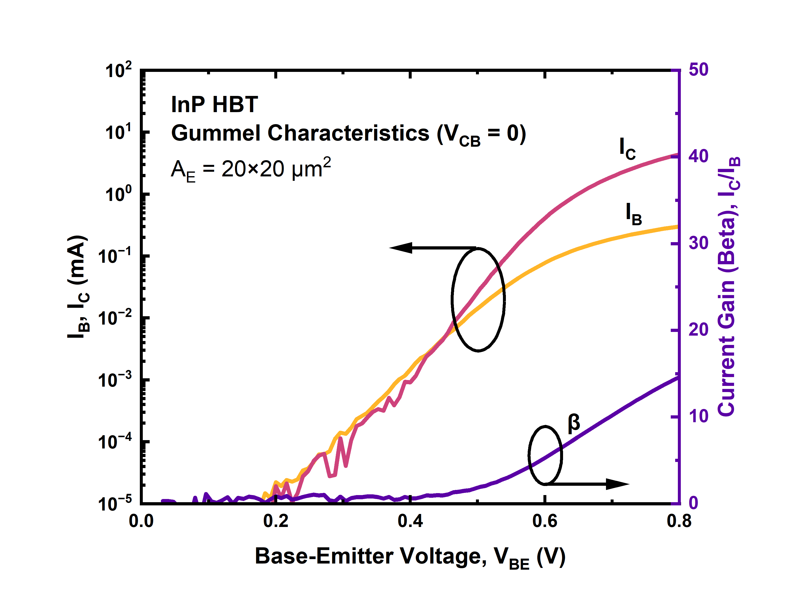
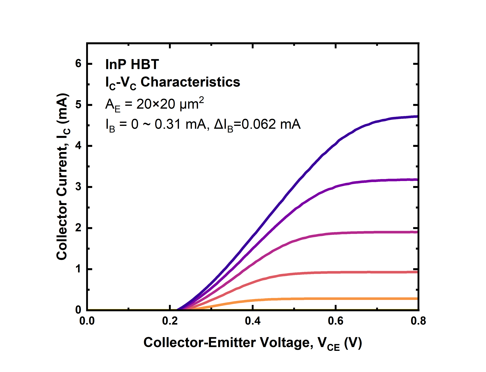

> 本專案於國立臺灣大學 IOED 實驗室完成

## 背景

**異質接面雙極性電晶體（HBT）** 是一種在不同區域採用不同材料的電晶體，而非像矽元件那樣僅使用單一材料。與僅使用單一載子的場效電晶體（FET）不同，HBT 同時利用電子與電洞進行導電。相較於單一材料的電晶體（如 BJT），異質接面設計具有較高的電流增益、更快的切換速度、更高的功率效率，以及更佳的設計彈性。這些優勢使其非常適合應用於高頻放大器與通訊系統。

其中一個應用範例是以 InP 為基礎的太赫茲 HBT，可用於產生或放大太赫茲波，並有潛力應用於未來 6G 網路中的超高速（>100 Gb/s）無線通訊。

## 元件

HBT 由三個區域組成：發射極、基極與集極。

## 製程流程

此元件的外延結構生長於 InP 基板上。在我們的實驗室中，我們使用 MA6 進行微影製程（photolithography），透過濕蝕刻形成 mesa 結構，接著沉積金屬接點，並進行退火處理，以形成與半導體之間的歐姆接觸。

## 直流量測

下圖顯示 Gummel 曲線與輸出特性曲線（family curves）。在本次量測中，我們於發射極尺寸為 20 μm 的元件上獲得最大電流增益（β）為 14.6。

## 未來工作

為了實現射頻（RF）元件，仍需進一步優化製程。目前 IOED 實驗室的重點改進方向包括：將接觸電阻降低至 1e-8 Ω·cm²、進行表面鈍化，以及提升製程良率。
