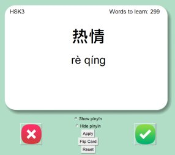
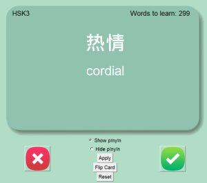
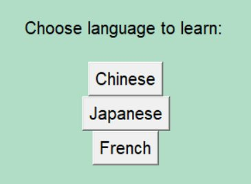
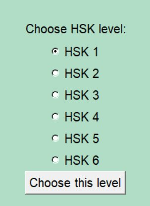
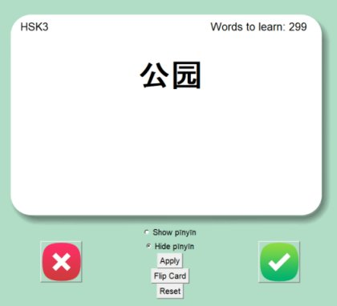

>This project is a modified version of the flashcard I learned to make from an online course.

## Background

One of the hardest parts of learning a new language is building your vocabulary. This is especially challenging if your native language is based on the Latin alphabet, and the language you’re learning is not.

Take Mandarin for example. The script used in Mandarin is called hànzì (汉字). Hànzì is arguably one of the biggest hurdles in learning Mandarin. While there is a romanized system for the characters (which is called pīnyīn), Mandarin learners should familiarize themselves with hànzì, since pīnyīn is mainly only used in learning.

## Motivation

I decided to make this flashcard project to learn Mandarin (and show a little bit of my Python skills). Luckily, a [course I took on Udemy](https://www.udemy.com/course/100-days-of-code) (great course, by the way) taught me the basic framework of flashcard apps, and I modified it to learn both Japanese and Mandarin.

## Results

Here are some screenshots from the app:

Source code: [Github](https://github.com/richardmedyanto/language-flashcard)