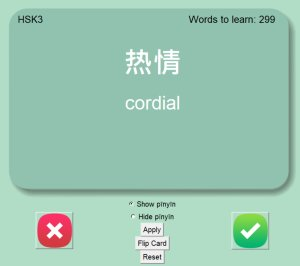
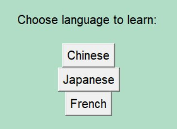
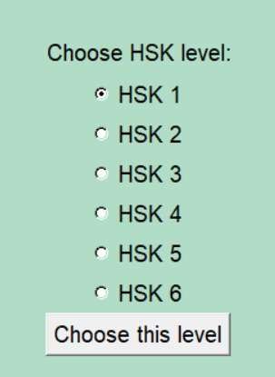
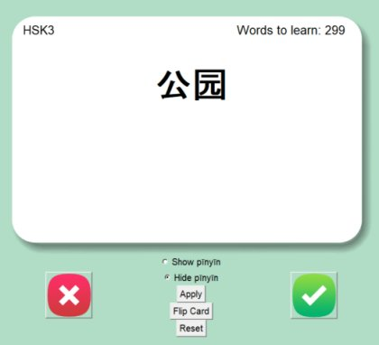

> 本專案為我基於線上課程所學習之閃卡（flashcard）應用所進行的改良版本。

| | |
|---|---|
|  |  |

## 背景

學習一門新語言最困難的部分之一是詞彙累積。對於母語使用拉丁字母的人來說，若目標語言使用不同書寫系統，學習難度會更高。

以中文為例，中文使用的書寫系統為漢字（hànzì，漢字）。漢字可以說是學習中文過程中最大的挑戰之一。雖然中文存在拼音系統（pīnyīn），但拼音主要用於學習階段，學習者仍需熟悉漢字本身。

## 動機

我開發此閃卡專案的初衷是為了學習中文，同時展示一些 Python 程式設計能力。幸運的是，我在 Udemy 上修習的一門課程（[100 Days of Code](https://www.udemy.com/course/100-days-of-code)，非常推薦）介紹了閃卡應用的基本架構，因此我在此基礎上進行修改，使其可同時用於學習日語與中文。

## 結果

以下為應用程式的部分截圖：

| | | |
|---|---|---|
|  |  |  |

原始碼： [Github](https://github.com/richardmedyanto/language-flashcard)