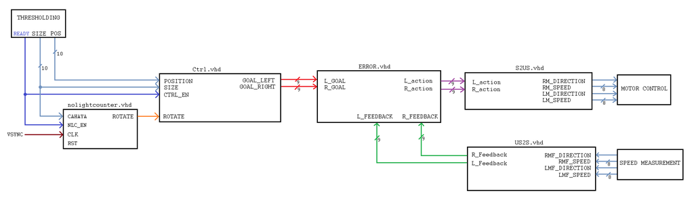
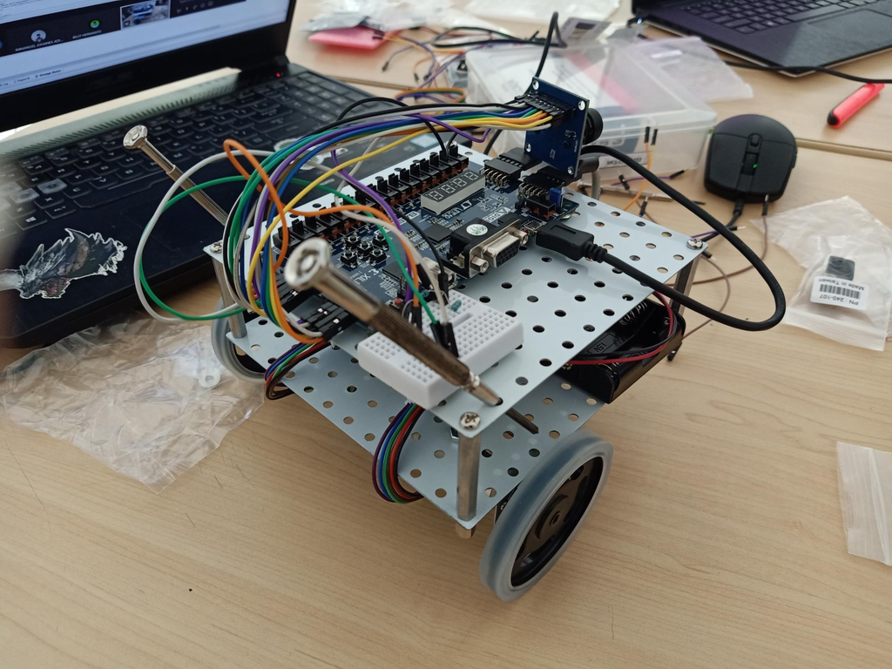

> This project was made for _Digital System_ course final exam in my 4th semester of undergraduate study.

## Objective

The objective of this project was to make a light-seeking robot that uses a BASYS 3 FPGA board, an OV7670 camera, and a set of motors with a PMOD HB5 H-Bridge. The programming is done using Vivado and VHDL.

Since this was a class project, we split into groups and divided tasks to make modules to control the robot. My group was responsible in deciding the direction and the speed of the robot given the input of the position and size of the light source.

## Steps

1. Define the requirements: input/outputs and communication between modules. This was done in class discussion.
2. Make the digital system of the module.
3. Translate the digital system into VHDL.
4. Combine the modules into one source code.
5. Test the code in the prototype.

## Module

This project was done by working closely with the threhsholding group and the motor control & speed measurement group.

The input from the thresholding group is the position of light source (10 bits of light size and position). If there is no light, the nolightcounter.vhd block is going to tell the robot to rotate 360 degrees before stopping. Otherwise, the size and position input are then used by the control block (Ctrl.vhd) to decide if the robot should go right, left, forward or backward. Then the left and right motor goal speeds are compared with the actual motor speeds by the error block (ERROR.vhd) to decide the required motor actions. The S2US.vhd and the US2S.vhd blocks are used to change signed values to unsigned and vice versa. They are connected to the motor control & speed measurement group which provide the actual motor speeds.

## Prototype

Note: there was a problem with the hardware side of the prototype, and since it was in the pandemic, we didn't get enough time to gather and finish the whole project.

## Contribution

As group leader, I led my team by delegating tasks to make the submodules, and represented my group in class discussions.

## Tutorial

We put the tutorials to make this project on [Instructables](https://www.instructables.com/VHDL-Motor-Speed-Control-Decide-Direction-and-Spee)