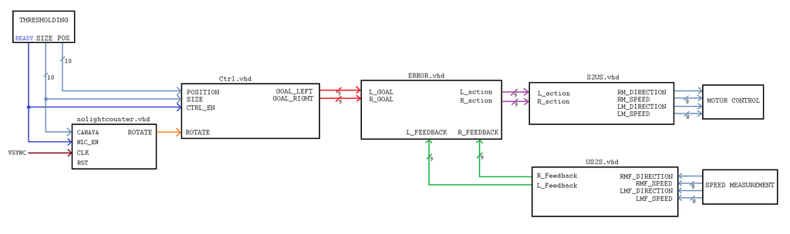
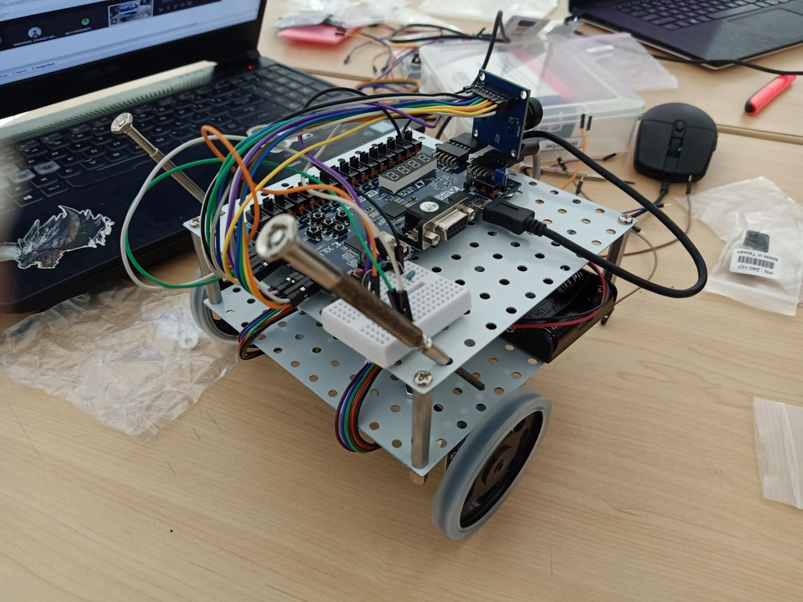

> 本项目为我本科第四学期《数字系统》课程期末项目。

## 目标

本项目的目标是开发一个寻光机器人，使用 BASYS 3 FPGA 开发板、OV7670 摄像头，以及通过 PMOD HB5 H-Bridge 驱动的一组电机。编程使用 Vivado 与 VHDL 完成。

由于这是课程项目，我们以小组形式分工合作，分别开发不同模块。我所在的小组负责根据光源的位置与大小输入，决定机器人的运动方向与速度。

## 步骤

1. 定义需求：输入/输出以及模块间通信（课堂讨论完成）
2. 设计模块的数字系统
3. 将数字系统转换为 VHDL 代码
4. 将各模块整合为完整系统
5. 在原型上进行测试

## 模块设计

本项目与阈值处理小组以及电机控制与测速小组紧密合作完成。

阈值处理模块输出光源的位置（10 位光强与位置数据）。如果没有检测到光源，nolightcounter.vhd 模块会让机器人先原地旋转 360 度后停止。否则，根据光源的大小与位置，控制模块（Ctrl.vhd）决定机器人向左、向右、前进或后退。

随后，左右电机的目标速度会与实际速度在误差模块（ERROR.vhd）中进行比较，从而计算所需的电机控制信号。S2US.vhd 与 US2S.vhd 模块用于有符号与无符号数据之间的转换，并与电机测速模块进行连接。

## 原型

注：由于硬件方面存在问题，加上当时处于疫情期间，我们没有足够时间完成整个项目的调试与收尾。

## 贡献

作为小组组长，我负责协调团队任务分工，推动各子模块开发，并代表小组参与课堂讨论与汇报。

## 教程

我们将该项目的制作教程发布在 [Instructables](https://www.instructables.com/VHDL-Motor-Speed-Control-Decide-Direction-and-Spee)

