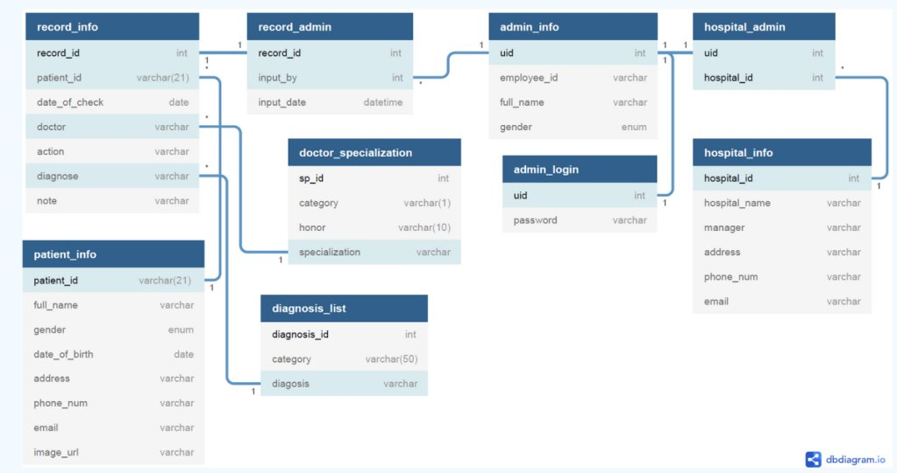
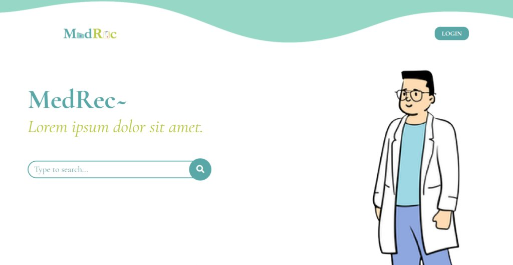
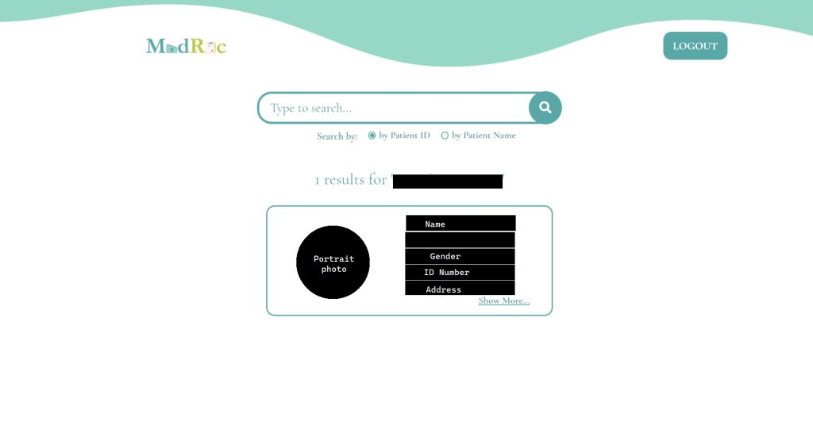

> This project was made for _Database Design and Application_ course final exam. This was finished in my 5th semester of undergraduate study.

## Background

Indonesian medical records systems are unintegrated, meaning data from one database can’t connect to another database. Hospitals also don’t have a way to know a patient’s medical record from other hospitals, while some hospitals and clinics still keep their patient records in paper.

An interview with one of the top agents in an insurance company shows that medical records are mainly important during the process to decide whether or not the insurance claim is legitimate. In the past, the process was done by contacting each hospital and asking them to give the customer’s data, which is inefficient, time consuming, and prone to fraud.

## Solution

To solve this problem, our team proposes to create a database system to centralize the medical record history of all Indonesian citizens. The database will be implemented in a website platform that can be accessed by institutes that need access to citizens’ medical record like the government, hospitals and insurance company.

## Benefits

It is beneficial for governments, since keeping track of the citizen’s health record can help government to know the health state of all citizens in Indonesia to make better decisions. Government can also reflect on how prepared Indonesia is in terms of medical technology and handling.

For insurance companies, having easier access to customer’s medical record can help insurance company avoid fraud registration from both customer and agents. Insurance company can easily select qualified new customer and effective decision making during claim process.

For hospitals, having this centralized digital database can help hospital in keeping the medical records of all the patients. With digital platform, hospital can save physical space required to store physical files. It is also easier for hospital to insert, edit, and search patient’s record. The data will be safer in digital because it won’t be missing and won’t be destroyed by natural disaster or accident. Hospital can also save time needed to search records when needed by the government, insurance company, or other related institutes. Also, one hospital can check the medical records of a patient from other hospitals.

## Database

MySQL is used as the database management system.

## Website Demo

