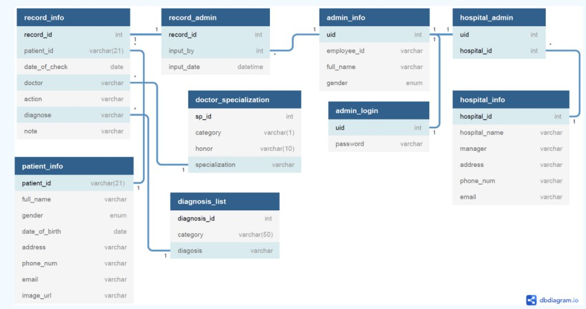
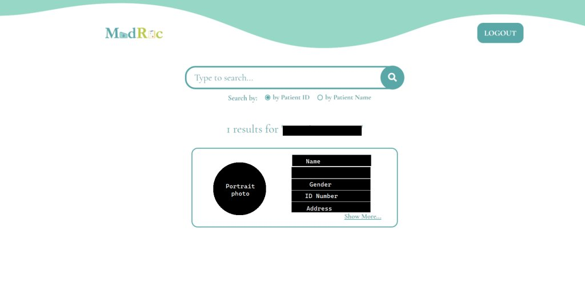

> 本项目为《数据库设计与应用》课程期末项目，于本科第五学期完成。

## 背景

印尼的医疗记录系统目前是分散且不互通的，这意味着一个数据库中的数据无法与其他数据库连接。此外，医院无法获取患者在其他医院的病历信息，而部分医院和诊所仍然使用纸质记录来保存病历。

对一家保险公司的资深业务人员访谈显示，医疗记录在判断保险理赔是否真实有效的过程中至关重要。过去，这一流程需要逐一联系各医院并索取患者资料，效率低下、耗时长，并且容易发生欺诈行为。

## 解决方案

为了解决这一问题，我们团队提出建立一个数据库系统，用于集中存储所有印尼公民的医疗记录历史。该数据库将以网站平台的形式实现，供政府、医院以及保险公司等需要访问医疗记录的机构使用。

## 优势

对于政府而言，集中管理公民健康记录可以帮助其了解全国居民的健康状况，从而制定更合理的政策，同时评估国家医疗技术与应对能力的发展水平。

对于保险公司而言，更便捷地访问客户医疗记录可以有效防止客户与代理人的欺诈行为，并帮助筛选合格的新客户，提高理赔决策效率。

对于医院而言，这一集中式数字数据库可以帮助其更高效地管理病历，减少纸质存储空间。数字化系统也使病历的录入、修改与查询更加便捷。同时，数据在数字化环境中更加安全，不易丢失，也不会因自然灾害或事故而损坏。医院在需要向政府、保险公司或其他机构提供数据时也能节省大量时间。此外，不同医院之间也可以共享患者病历信息。

## 数据库

系统采用 MySQL 作为数据库管理系统。

## 网站演示

