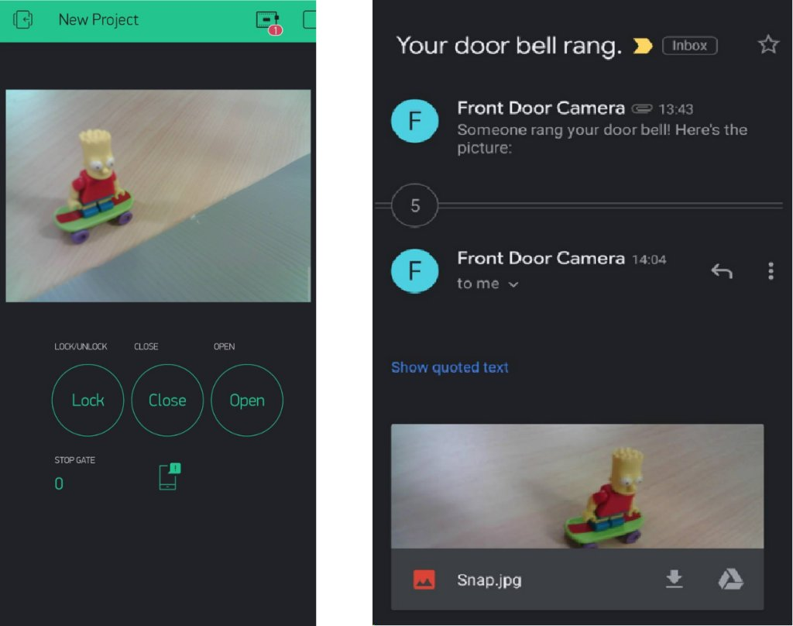
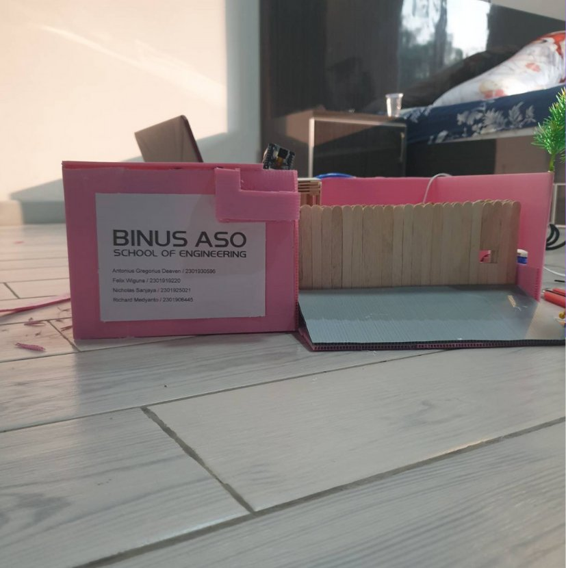

> This project was made for _Computer Networks_ course final exam in my 4th semester of undergraduate study.

## Background

Opening and closing house gates when driving a vehicle is risky. As the driver gets out of the vehicle to open/close the gates, auto theft is a possibility; especially if the driver forgot to lock their car. 

Another issue is the inconvenience of checking every time the doorbell rang. The homeowner also wouldn't know who's coming when they're not home.

## Solution

Our team proposes an IoT solution to control house gates and monitor through a CCTV using mobile phones. Existing solutions use motors to control gates and CCTV with recording saved to a drive; both can be controlled from inside the house. Our goal is to utilize the internet so that it can be controlled using mobile phones: something we always bring, everywhere.

## Prototype

For the prototype, we used an ESP32 as the gate controller and an ESP32-cam to capture and send pictures. A doorbell is used so that when pressed, the system will notify the homeowner, and show the picture of the person who clicked the doorbell on the homeowner’s phone, and also sends the picture via email to the homeowner. We used Blynk for the user interface.

Watch the video below for demo:



