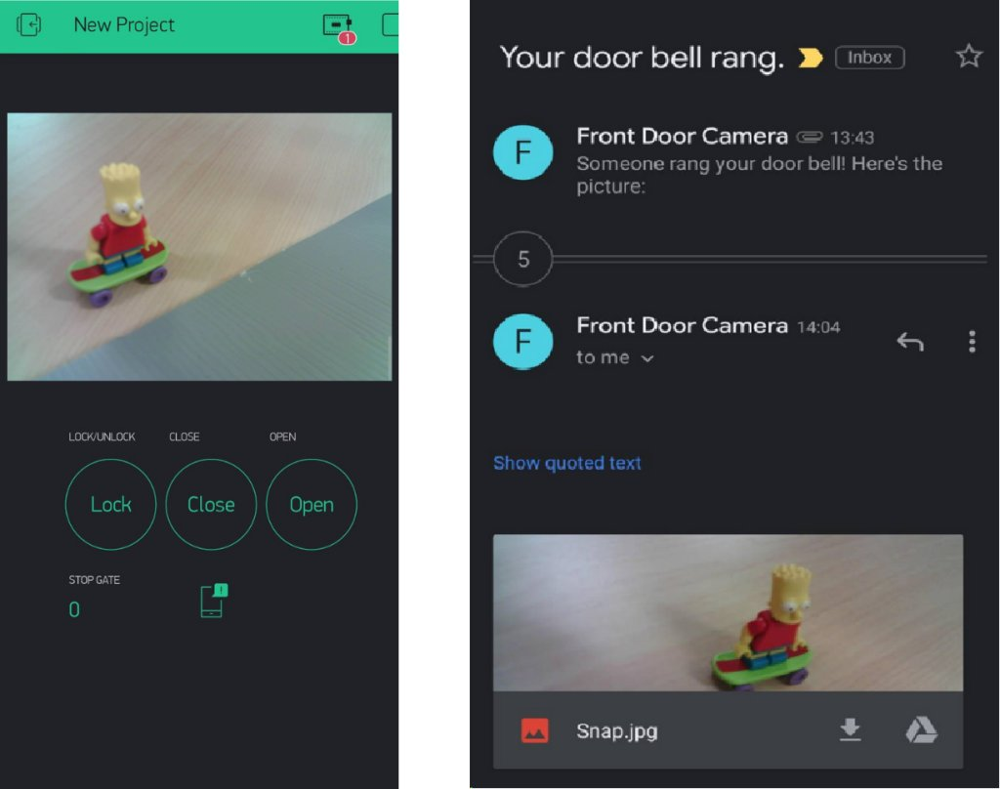
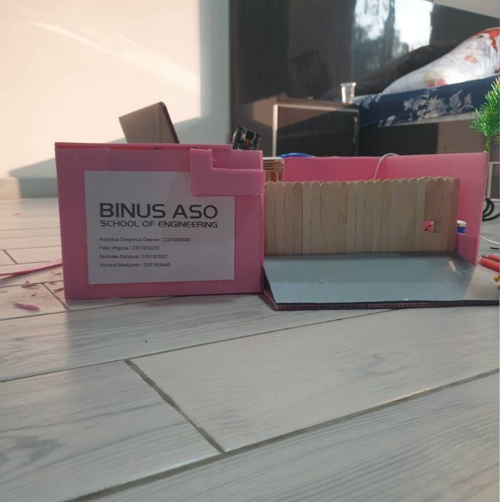

> 本專案為我大學第四學期《電腦網路》課程的期末專案。

## 背景

在駕駛車輛時開關家門具有一定風險。當駕駛下車開關大門時，車輛可能面臨被竊的風險，尤其是在忘記上鎖的情況下。

另一個問題是，每當門鈴響起時都需要親自查看，十分不便。此外，當屋主不在家時，也無法得知來訪者的身分。

## 解決方案

我們團隊提出了一套物聯網（IoT）解決方案，透過手機控制家門並結合 CCTV 進行監控。現有系統通常透過馬達控制大門，並將監控影像儲存在本地裝置中，且多半只能在室內操作。我們的目標是透過網際網路，使系統可以用手機遠端控制——手機是我們隨身攜帶的裝置。

## 原型

在原型設計中，我們使用 ESP32 作為大門控制器，並使用 ESP32-CAM 進行影像擷取與傳輸。同時加入門鈴功能，當有人按下門鈴時，系統會通知屋主，在手機上顯示訪客影像，並透過電子郵件傳送該影像。使用者介面則採用 Blynk 建立。

| | |
|--|--|
|  |  |

請觀看下方影片示範：

