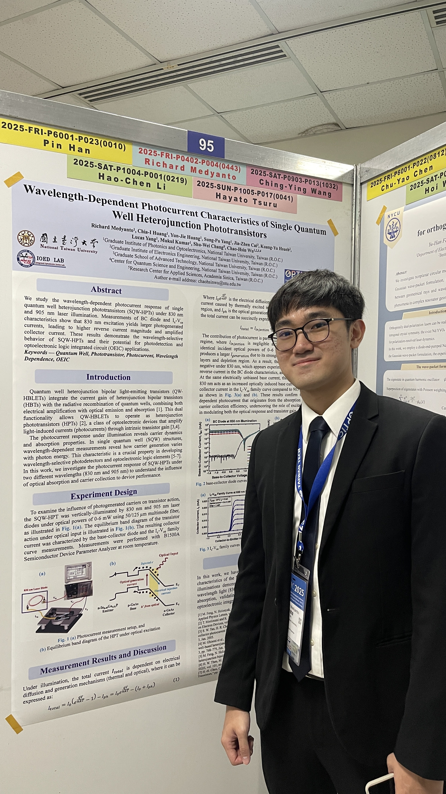
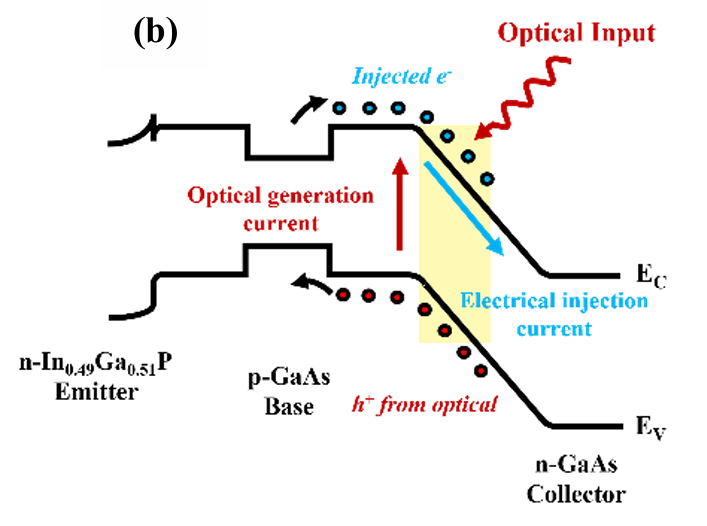
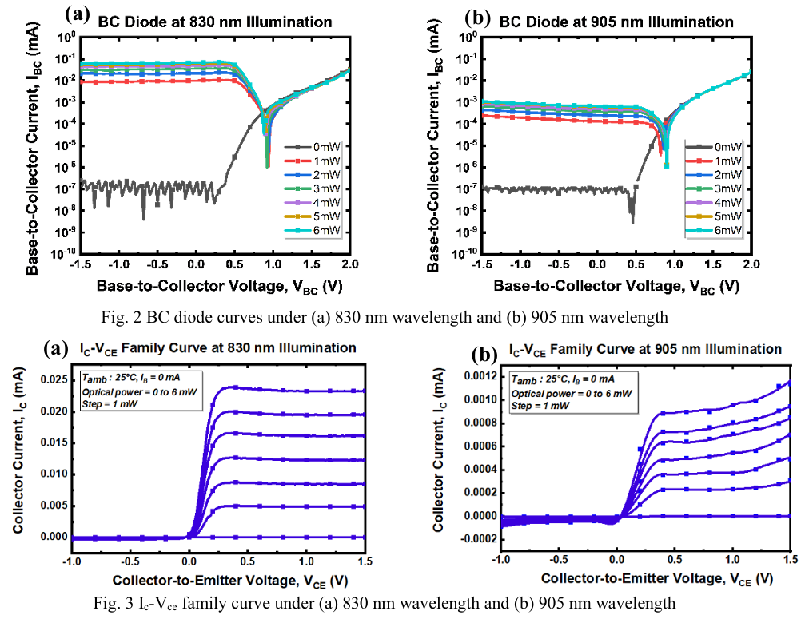

> 本项目在台湾大学 IOED 实验室完成

## OPTIC 2025

我有机会在 **Optics & Photonics Taiwan International Conference (OPTIC) 2025**（2025 年 12 月举办）上展示我的研究成果。这是一次非常宝贵的经历，让我能够与来自光电子领域的研究人员和工程师分享我们在异质结光电晶体管方面的工作，并深入了解光子学和半导体器件研究的最新进展。

## 研究

我们的研究探讨了 **单量子阱异质结光电晶体管（SQW-HPT）** 的波长依赖光电流响应。这类器件结合了异质结双极型晶体管（HBT）的电流增益特性以及量子阱的光吸收能力。通过使用 830 nm 和 905 nm 激光二极管照射器件，我们研究了不同光子能量如何影响载流子产生，进而影响晶体管输出。

核心概念是，在光照条件下，耗尽区中光生载流子会作为一种“光致基极电流”，并被晶体管的内在增益放大。下方的能带图展示了晶体管在光输入下的工作原理：光子在量子阱和耗尽区附近被吸收，产生并驱动载流子，从而形成光电流。

由于 830 nm 光具有更短的波长（更高的光子能量），相比 905 nm 光，在基于 GaAs 的有源层中吸收更强。这会产生更大的光生电流，在基极-集电极（BC）二极管特性中表现为更高的反向电流幅值，并在 Ic–Vce 特性曲线中体现为更大的集电极电流。

这些结果验证了 SQW-HPT 的波长选择性特性，使其成为波长选择型光电探测器以及光电集成电路（OEIC）应用的有前景候选器件。
