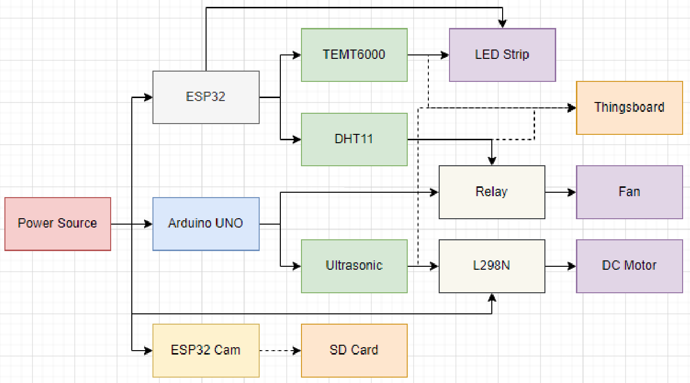
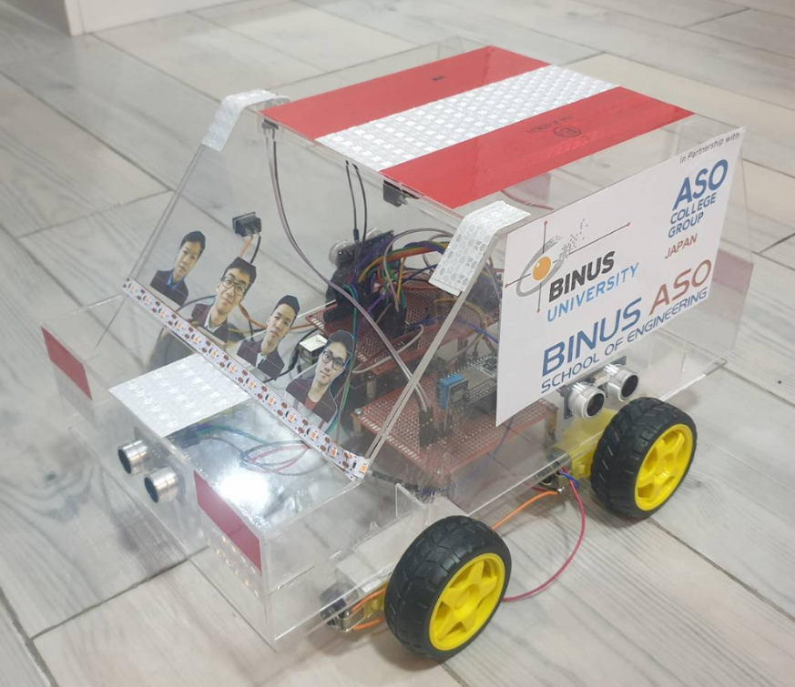

> This project was made for _Microcontroller Design and Aplication,
Automotive Engineering,
Computer System Development and Methodology_ course final exam in my 6th semester of undergraduate study.

## Background

In 2020, 30.668 people died in Indonesia as a result of traffic accidents, making them the country's second biggest cause of mortality after health-related deaths. 

An automobile cabin that is exposed to the sun might get very hot, which potentially trigger chemical processes that create hazardous gases within the cabin. Additionally, a person exposed to a high temperature environment may suffer from a heat stroke.

According to data from the road safety action network (Safe Distance), 33.63% of incidents happened between 18:00 to 24:00 in 2016, implying the cause being the low-light condition.

## Solution

A smart car system that integrates multiple smart features to solve the problems described in the background.

## Features

* Cruise control
* Collision prevention
* Automatic cabin cooling system
* Automatic headlight system
* Camera monitoring system

## Block Diagram

Here is the block diagram of the prototype.

As an integrated system, the prototype uses multiple microcontrollers communicating with each other using I2C. Multiple sensors are also utilized to detect the different types of inputs from the environment. For example, the ESP32 receives the light intensity input from the TEMT6000, and the Arduino Uno receives obstacle distance inputs from the 4 HC-SR04 ultrasonic sensors.

## Prototype 

## Demonstration

