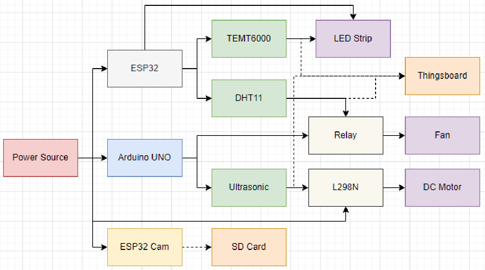
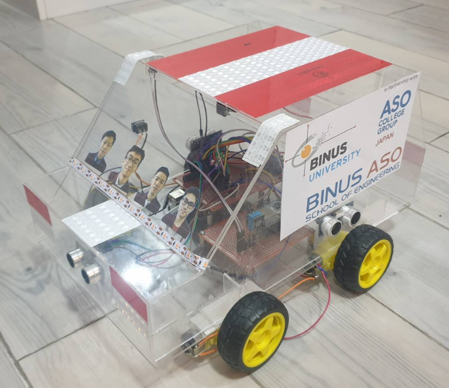

> 本專案為我大學第六學期課程 *Microcontroller Design and Application、Automotive Engineering、Computer System Development and Methodology* 的期末專案。

## 背景

2020 年，印尼因交通事故死亡人數達 30,668 人，為僅次於健康相關死亡的第二大死因。

長時間曝曬於陽光下的車內空間可能會變得非常高溫，進而引發化學反應產生有害氣體。此外，處於高溫環境中的人也可能發生中暑。

根據道路安全行動網絡（Safe Distance）的資料，2016 年有 33.63% 的事故發生於 18:00 至 24:00，顯示低光照環境可能是重要因素之一。

## 解決方案

設計一套整合多種智慧功能的智慧車系統，以解決上述問題。

## 功能

* 定速巡航
* 防撞系統
* 自動車室降溫系統
* 自動頭燈系統
* 攝影監控系統

## 系統方塊圖

以下為原型系統的方塊圖：

此原型為整合式系統，使用多個微控制器並透過 I2C 通訊。系統亦搭配多種感測器以偵測環境輸入。例如，ESP32 接收來自 TEMT6000 的光強訊號，而 Arduino Uno 則接收來自 4 個 HC-SR04 超音波感測器的距離資訊。

## 原型

## 示範


