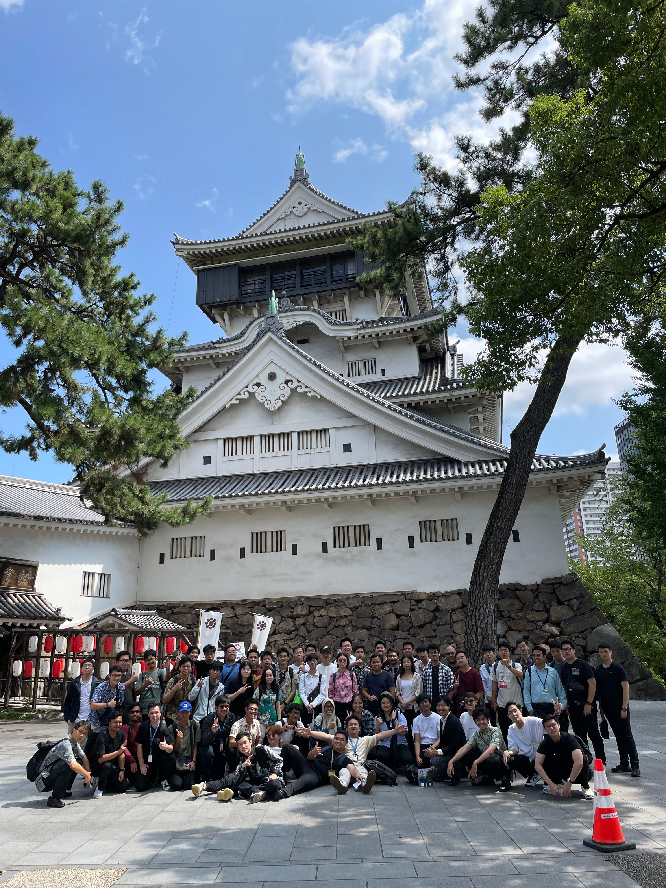
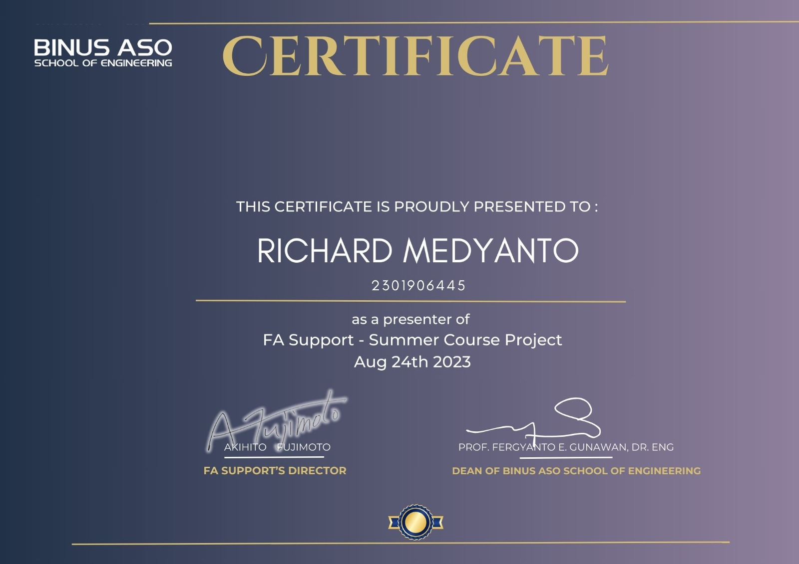

## Summer Course

As a Binus ASO student, we had the opportunity to take part in summer course in Fukuoka, Japan. For me, it was in the summer of 2023. This event had been highly anticipated ever since the beginning of the first  semester in campus. It was awesome.

The event was made possible by the collaboration between Binus University (Indonesia) and ASO College (Japan), and I was blown away by the quality of the summer course curriculum. We had hands-on lessons about car transmission, car engines, airbags and safety devices, mechanical design and manufacturing. The off-campus experience were also wonderful, with trips to museums, shrines, and a factory visit. Additionally, there were classes about Japanese manners and the Japanese work experience, which provided more insight about life in Japan. 

## FA Support Internship

The summer course also included a month-long internship program. The company I interned at is called FA Support (ＦＡサポート), a Japanese industrial automation company. The internship began before the summer course had started. We were briefed about the requirement of the project, which was to make an automated tray dropper concept. The output of this project was a 3D design and presentation of our concept. During the summer course, we presented our work to the company president and other staff members, who were kind enough to give feedback about our creations, which prompted several improvements for the final presentation. Overall, this internship was a short but interesting experience.

