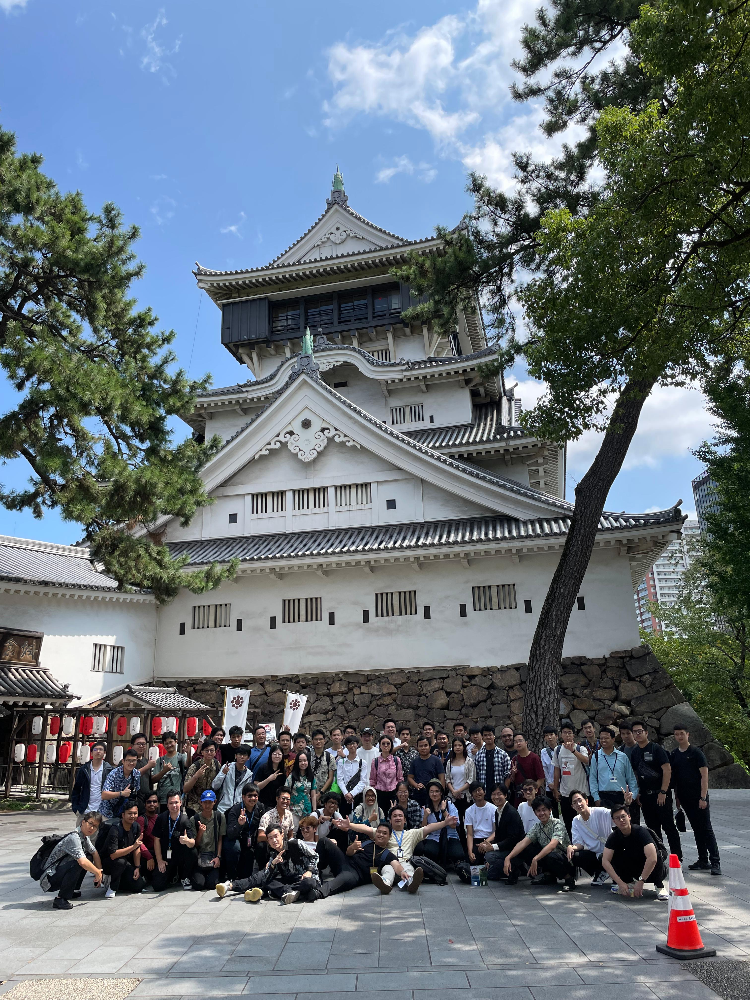
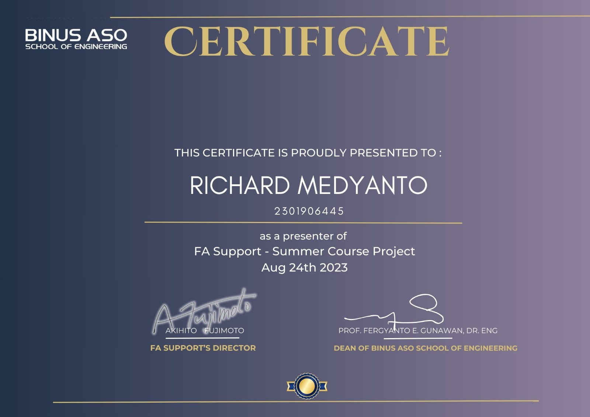

## 夏季課程

身為 Binus ASO 的學生，我有幸於 2023 年夏天前往日本福岡參加夏季課程。這項活動自學期初便令人期待，而實際體驗也完全不負眾望。

該夏季課程由印尼 Binus 大學與日本 ASO College 合作舉辦，其課程品質令我印象深刻。我們參與了許多實作課程，內容涵蓋汽車傳動系統、引擎、安全氣囊與安全裝置，以及機械設計與製造等。

課外活動同樣精彩，包括參觀博物館、神社以及工廠。此外，有關日本禮儀與職場文化的課程，也讓我們對日本生活有更深入的理解與體會。

## FA Support 實習

夏季課程亦包含為期一個月的實習計畫。我實習的公司為 FA Support（ＦＡサポート），是一家日本工業自動化公司。實習在夏季課程開始前即已展開，我們首先了解專案需求，即設計一個自動托盤投放裝置的概念。最終成果為 3D 設計與簡報展示。

在夏季課程期間，我們向公司社長及員工進行成果發表。他們提供了許多寶貴的建議，使我們得以持續改進最終成果。整體而言，這段實習雖然時間不長，但十分充實且有趣。

